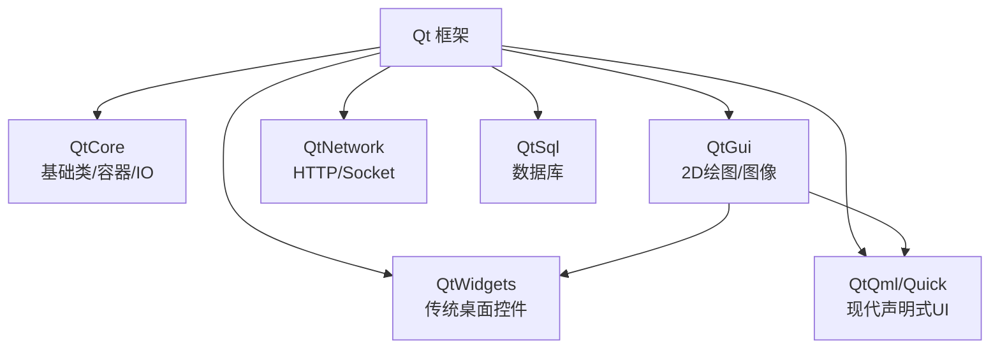

# 1. Qt 框架基础

> 难度分布：🟢 入门 5 题 · 🟡 进阶 9 题 · 🔴 高难 1 题

[[toc]]

---


## 一、Qt 概览与架构





### Q1: ⭐🟢 Qt 到底是什么？为什么工业桌面软件这么爱用它？


A: 结论：Qt 是一个跨平台 C++ 应用开发框架，不只是 GUI 库，而是一整套桌面开发基础设施。它在工业软件里常见，是因为跨平台、稳定、模块全、工具链成熟。


详细解释：


- Qt 提供 `QtCore`、`QtGui`、`QtWidgets`、`QtNetwork`、`QtSql`、`QtSerialPort` 等模块。
- 它解决的不只是“画界面”，还包括对象模型、事件循环、线程、网络、国际化、资源管理、部署等工程问题。
- 对上位机、配置工具、调试工具、嵌入式 HMI 来说，Qt 的整体交付效率很高。


代码示例：


```cpp
#include <QApplication>
#include <QPushButton>

int main(int argc, char *argv[]) {
    QApplication app(argc, argv);
    QPushButton btn("Hello Qt");
    btn.show();
    return app.exec();
}
```


常见坑/追问：


- Qt 不等于只有 Widgets，QML/Quick 也是 Qt 的重要 UI 技术路线。
- 面试官常追问：Qt 和标准 C++ 的边界在哪里？核心回答是 Qt 构建在 C++ 之上，但补了元对象系统这块能力。

> 💡 **面试追问**：线程池的核心参数如何调优？线程数设多少合适？


### Q2: ⭐🟢 Qt 和标准 C++ 是什么关系？


A: 结论：Qt 是建立在 C++ 之上的框架，但通过 MOC、元对象系统、信号槽等机制扩展了标准 C++ 原生不擅长的能力。你可以把 Qt 理解为“现代 C++ + 一层工程化运行时”。


详细解释：


- 标准 C++ 负责语言层面的对象、模板、泛型、资源管理。
- Qt 提供 `QObject`、信号槽、属性系统、动态属性、对象树、事件系统。
- 标准 C++ 没有完整反射，Qt 用 MOC 在编译阶段生成元信息代码。


代码示例：


```cpp
class MyObject : public QObject {
    Q_OBJECT
public:
    explicit MyObject(QObject* parent = nullptr) : QObject(parent) {}
signals:
    void finished();
};
```


常见坑/追问：


- `Q_OBJECT` 不是“所有 Qt 类都必须写”，只有用到元对象能力时才需要。
- 追问常见：Qt 能否不用 MOC？部分场景能，但信号槽/反射等核心机制会受限。

> 💡 **面试追问**：信号槽与回调函数相比有何优劣？跨线程信号槽如何工作？


### Q3: 🟢 Qt 的核心模块通常怎么划分？


A: 结论：面试里最稳的讲法是按 Core、GUI、Widgets、Quick/QML、Network、Sql、Concurrent 来分。这样既清晰，也能体现工程视角。


详细解释：


- `QtCore`：对象系统、容器、事件循环、时间、文件、线程基础。
- `QtGui`：绘图、字体、图像、输入事件。
- `QtWidgets`：传统桌面控件体系。
- `QtQuick/QML`：声明式 UI，适合动画和现代交互。
- `QtNetwork`：TCP/UDP/HTTP。
- `QtSql`：数据库访问。
- `QtConcurrent`：更高层的并发接口。


常见坑/追问：


- 不要把 `QtGui` 和 `QtWidgets` 混成一层。
- 追问可能会问：为什么 `QWidget` 程序还要用 `QApplication` 而不是 `QCoreApplication`。

> 💡 **面试追问**：线程池的核心参数如何调优？线程数设多少合适？


### Q4: 🟡 Qt 的跨平台能力靠什么实现？


A: 结论：Qt 的跨平台本质是“统一 API + 平台适配层 + 构建系统支持”。业务代码写一套，平台差异由 Qt 底层屏蔽。


详细解释：


- 上层代码调用的是统一接口，如文件、网络、线程、事件、窗口。
- 底层通过 platform plugin、窗口系统适配、图形后端适配处理 Windows/Linux/macOS 差异。
- 构建和部署层面，Qt 也提供了相对统一的工程组织方式。


常见坑/追问：


- 跨平台不代表“完全不改代码”，路径、编码、权限、字体、输入法、高 DPI 都可能踩坑。

> 💡 **面试追问**：线程池的核心参数如何调优？线程数设多少合适？


## 二、信号与槽

### Q5: ⭐🟡 Qt Widgets 和 Qt Quick/QML 应该怎么选？


A: 结论：传统工业桌面工具优先 Widgets；需要流畅动画、声明式 UI、触控界面时更偏向 QML。没有绝对优劣，关键看业务场景。


详细解释：


- Widgets：成熟稳定，控件丰富，适合表单、树表、传统工具软件。
- QML/Quick：UI 描述效率高，动画强，前后端分离自然，更适合现代界面。
- 工业上位机大量项目依然是 Widgets，因为维护成本和稳定性优先。


代码示例：


```cpp
// Widgets 更偏传统 C++ 控件拼装
QPushButton* btn = new QPushButton("Start", this);

// QML 更偏声明式界面描述
// Button { text: "Start" }
```


常见坑/追问：


- 不要说“QML 就一定比 Widgets 快”，很多时候是开发交互效率更高，不等于所有场景都性能更好。

> 💡 **面试追问**：这个知识点在实际项目中怎么用？有没有遇到过相关 bug 或性能问题？


### Q6: 🟡 QObject 和普通 C++ 类最大的区别是什么？


A: 结论：`QObject` 不只是一个基类，它带来了元对象系统、对象树、信号槽、动态属性和线程亲和性等 Qt 特有语义。普通 C++ 类默认没有这些运行时能力。


详细解释：


- `QObject` 派生类一般禁拷贝。
- 可以通过 parent-child 形成对象树，自动释放子对象。
- 有 `metaObject()`、`property()`、`setProperty()` 等元信息访问能力。
- 每个 `QObject` 还关联所属线程。


代码示例：


```cpp
QObject* child = new QObject(parent);
qDebug() << child->thread();
qDebug() << child->parent();
```


常见坑/追问：


- `QObject` 禁止拷贝，面试官常问原因：对象树、连接关系、线程归属都不适合值语义拷贝。

> 💡 **面试追问**：线程池的核心参数如何调优？线程数设多少合适？


### Q7: ⭐🟡 QApplication、QCoreApplication、QGuiApplication 有什么区别？


A: 结论：三者是不同层级的应用对象：`QCoreApplication` 只要事件循环；`QGuiApplication` 增加图形环境；`QApplication` 再增加 Widgets 支持。选型要与项目类型匹配。


详细解释：


- `QCoreApplication`：控制台程序、后台服务、无 GUI 程序。
- `QGuiApplication`：需要窗口系统和图形能力，但不用 Widgets。
- `QApplication`：Widgets 程序必须用它。


代码示例：


```cpp
int main(int argc, char *argv[]) {
    QCoreApplication app(argc, argv); // 无界面程序
    return app.exec();
}
```


常见坑/追问：


- Widgets 程序错误地使用 `QCoreApplication` 会导致控件无法工作。
- 追问常见：QML 程序通常用 `QGuiApplication`。

> 💡 **面试追问**：这个知识点在实际项目中怎么用？有没有遇到过相关 bug 或性能问题？


### Q8: 🟢 Qt 的典型应用场景有哪些？


A: 结论：Qt 典型场景包括工业上位机、设备调试工具、跨平台桌面客户端、嵌入式 Linux 图形界面和仪器仪表软件。回答时最好结合行业而不是只说“做 GUI”。


详细解释：


- 工业控制：参数配置、实时监控、协议通信。
- 医疗/仪器：显示面板、数据采集、设备控制。
- 开发辅助工具：烧录器、日志查看器、测试工具。
- 嵌入式：中控屏、触摸界面、HMI。


常见坑/追问：


- 回答太泛会显得没项目感，最好顺带说通信、数据库、日志、线程模型这些配套能力。

> 💡 **面试追问**：线程池的核心参数如何调优？线程数设多少合适？


## 三、事件系统

### Q9: ⭐🟡 Qt 的优势和代价分别是什么？


A: 结论：Qt 的优势是开发效率高、跨平台、生态完整；代价是学习曲线不低、框架规则较多、部署体积和机制理解成本偏高。它强在工程效率，不是“零心智成本”。


详细解释：


- 优势：信号槽、对象树、跨平台 UI、网络/串口/SQL 全家桶。
- 代价：MOC、事件循环、对象线程亲和性、隐式共享、部署依赖都要掌握。
- 越是大项目，越能体现 Qt 的整体价值；越是小脚本工具，可能越显得“重”。


常见坑/追问：


- 面试别只吹优点，能讲出代价和边界更像真做过项目的人。

> 💡 **面试追问**：线程池的核心参数如何调优？线程数设多少合适？


### Q10: 🟡 什么是 qrc 资源系统？为什么 Qt 喜欢把资源编进程序？


A: 结论：qrc 是 Qt 的资源系统，用来把图片、图标、翻译、qml 等资源编译进可执行文件或库中。它提高了部署稳定性，避免运行时找不到资源文件。


详细解释：


- 资源通过 `.qrc` 清单声明。
- 运行时通过 `:/prefix/file` 访问。
- 适合图标、默认配置、样式表、内置 qml 等静态资源。


代码示例：


```xml
<RCC>
  <qresource prefix="/img">
    <file>icons/start.png</file>
  </qresource>
</RCC>
```


```cpp
QPixmap pix(":/img/icons/start.png");
```


常见坑/追问：


- 资源路径大小写在 Linux 下敏感。
- 资源更新频繁且体积大时，不一定适合全部编进程序。

> 💡 **面试追问**：这个知识点在实际项目中怎么用？有没有遇到过相关 bug 或性能问题？


### Q11: ⭐🟡 Qt 的国际化 i18n 一般怎么做？


A: 结论：Qt 国际化核心是 `tr()` 标记文本、`lupdate` 提取翻译、`linguist` 编辑、`lrelease` 生成 `.qm`，运行时通过 `QTranslator` 加载。它是成熟的桌面应用 i18n 方案。


详细解释：


- 源码中写可翻译字符串：`tr("Open")`。
- 用工具提取成 ts 文件。
- 翻译后生成 qm。
- 启动时安装翻译器。


代码示例：


```cpp
QTranslator translator;
translator.load(":/i18n/app_zh_CN.qm");
qApp->installTranslator(&translator);
```


常见坑/追问：


- 不要把需要翻译的文案写死成普通字符串。
- 动态切换语言后，界面通常要重新翻译或刷新文本。

> 💡 **面试追问**：这个知识点在实际项目中怎么用？有没有遇到过相关 bug 或性能问题？


## 四、Qt 对象模型

### Q12: 🟢 面试里一句话怎么评价 Qt？


A: 结论：可以这样总结：Qt 是面向工程交付的跨平台 C++ 框架，强项在 GUI、对象模型、事件驱动和通信能力的整体整合。这个回答短，但很稳。


详细解释：


- “面向工程交付”体现的是它不是单点库。
- “对象模型、事件驱动、通信”正好覆盖 Qt 的核心差异化能力。


常见坑/追问：


- 如果面试官继续追问，就顺着讲信号槽、对象树、线程和 QML/Widgets 选型，不要卡在定义本身。

> 💡 **面试追问**：线程池的核心参数如何调优？线程数设多少合适？


### Q13: ⭐🟡 Qt 插件机制是什么？怎么实现一个插件？


A: 结论：Qt 插件系统基于 `QPluginLoader` + 接口类 + 实现类，允许运行时动态加载共享库扩展功能，是解耦和扩展性的重要手段。


详细解释：


- 定义纯虚接口类（带 `Q_DECLARE_INTERFACE`）。
- 插件库实现接口并声明 `Q_INTERFACES`/`Q_PLUGIN_METADATA`。
- 主程序用 `QPluginLoader::instance()` 获取接口对象。
- 常用于上位机设备适配层：不同设备型号分别出插件，主程序统一调度。


代码示例：


```cpp
// 接口头文件
class IDevice {
public:
    virtual ~IDevice() = default;
    virtual bool open() = 0;
    virtual QByteArray read() = 0;
};
Q_DECLARE_INTERFACE(IDevice, "com.example.IDevice/1.0")

// 插件实现
class UsbHidDevice : public QObject, public IDevice {
    Q_OBJECT
    Q_INTERFACES(IDevice)
    Q_PLUGIN_METADATA(IID "com.example.IDevice/1.0")
public:
    bool open() override { return true; }
    QByteArray read() override { return {}; }
};

// 主程序加载
QPluginLoader loader("libusb_hid_device.so");
if (auto* dev = qobject_cast<IDevice*>(loader.instance())) {
    dev->open();
}
```


常见坑/追问：


- 插件接口变化会导致 ABI 不兼容，要做接口版本化。
- 追问：Qt 内部哪里大量用了插件机制？平台适配（xcb、winrt 平台插件）就是典型。

> 💡 **面试追问**：这个知识点在实际项目中怎么用？有没有遇到过相关 bug 或性能问题？


### Q14: ⭐🟡 Qt Resource System（qrc）的工作原理是什么？大文件适合放进去吗？


A: 结论：qrc 在编译时把资源文件转为 C++ 数组嵌入可执行文件，通过虚拟文件系统 `:/` 访问，部署稳定但不适合大文件或频繁更新资源。


详细解释：


- `rcc` 工具把 `.qrc` 中的资源序列化为 C++ 数据表。
- 运行时通过 `QFile(":/path")` 或 `QPixmap(":/icon")` 访问。
- 优点：单文件发布，资源不会找不到；缺点：可执行体积增大，修改需要重编译。
- 替代方案：大资源放到外部文件，启动时通过配置路径加载。


代码示例：


```xml
<RCC>
  <qresource prefix="/config">
    <file>defaults.json</file>
  </qresource>
</RCC>
```


```cpp
QFile f(":/config/defaults.json");
f.open(QFile::ReadOnly);
QByteArray data = f.readAll();
```


常见坑/追问：


- 把几百 MB 的地图/升级包放进 qrc 会大幅增加可执行文件并拖慢链接速度。
- 追问：如何在不重编的前提下更新资源？用外部文件路径 + 运行时 `QDir` 加载。

> 💡 **面试追问**：这个知识点在实际项目中怎么用？有没有遇到过相关 bug 或性能问题？


### Q15: ⭐⭐⭐🔴 Qt Quick/QML 和 Widgets 在渲染架构上有什么本质不同？


A: 结论：Widgets 基于 QPainter/软件光栅化，控件重绘是命令式的；QML/Quick 基于场景图（Scene Graph），走 OpenGL/Vulkan/Metal 硬件加速，渲染是声明式的。两者根本架构不同。


详细解释：


- Widgets：`paintEvent` 里调用 `QPainter`，CPU 绘制，控件树同步更新。
- Quick：Scene Graph 维护节点树，后台渲染线程用 GPU 批量提交。
- 动画密集、粒子效果、复杂视觉变换：Quick 明显占优。
- 表单、树表、传统工具栏：Widgets 开发效率更高。


常见坑/追问：


- Widgets 在高 DPI 下需要手动处理，Quick 原生更好处理 DPI 变换。
- 追问：两种技术能混用吗？可以，`QQuickWidget` 或 `QWidget::createWindowContainer` 都可集成。

---

> 💡 **面试追问**：线程池的核心参数如何调优？线程数设多少合适？

---

## 📊 本章统计

| 指标 | 数量 |
|------|------|
| 总题目数 | 15 |
| 🟢 入门 | 5 |
| 🟡 进阶 | 9 |
| 🔴 高难 | 1 |
