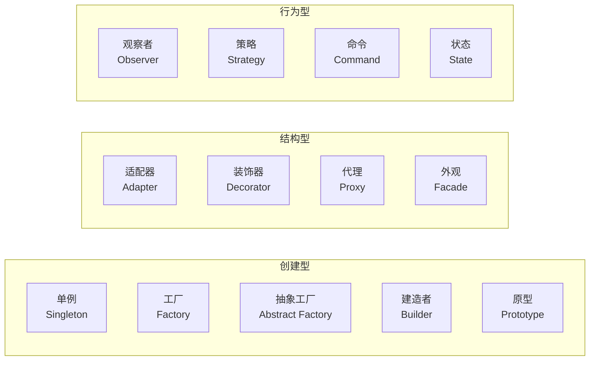

# 14. 设计模式

> 难度分布：🟢 入门 1 题 · 🟡 进阶 12 题 · 🔴 高难 2 题

[[toc]]

---

graph LR
    A[设计模式] --> B[创建型]
    A --> C[结构型]
    A --> D[行为型]
    B --> B1[单例/工厂/建造者/原型]
    C --> C1[适配器/装饰/代理/组合]
    D --> D1[观察者/命令/状态/策略/模板]


## 一、创建型模式





### Q1: ⭐🟢 什么是设计模式？面试里该怎么答才不空？


A: 结论：设计模式是可复用的设计经验，不是固定代码模板。面试时要结合“解决什么问题、代价是什么、项目里怎么落地”来回答，而不是背定义。


详细解释：


- 创建型：解决对象创建复杂性。
- 结构型：解决类/对象组合关系。
- 行为型：解决职责分配和交互。
- 模式的价值在于降低耦合、提升扩展性，但过度使用会让代码抽象过重。


常见坑/追问：


- 不要把“我写了个单例”就当设计能力展示。
- 追问：什么时候不该用模式？当简单需求被过度抽象时。

> 💡 **面试追问**：模板编译期展开有什么代价？如何减少模板实例化导致的代码膨胀？


### Q2: ⭐🟡 单例模式怎么实现？它有什么争议？


A: 结论：现代 C++ 推荐用函数内静态变量实现线程安全单例，但单例最大问题不是写法，而是它天然引入全局状态、隐藏依赖、难测试。


详细解释：


- C++11 起局部静态初始化线程安全。
- 单例适合日志器、配置中心这类全局唯一资源，但也要控制副作用。
- 更推荐通过依赖注入暴露接口，而不是 everywhere `Instance()`。


代码示例：


```cpp
class Logger {
public:
    static Logger& instance() {
        static Logger obj;
        return obj;
    }
private:
    Logger() = default;
};
```


常见坑/追问：


- 手写双重检查锁在现代 C++ 里通常没必要且容易写错。
- 追问：单例析构顺序问题怎么处理？静态对象析构期可能踩全局依赖坑。

> 💡 **面试追问**：线程池的核心参数如何调优？线程数设多少合适？


### Q3: ⭐🟡 工厂模式和抽象工厂模式有什么区别？


A: 结论：工厂方法通常解决“创建某一类产品”；抽象工厂解决“创建一组相关产品族”。前者偏单产品扩展，后者偏整体风格一致性。


详细解释：


- 简单工厂：一个工厂根据参数创建不同对象。
- 工厂方法：把创建延迟到子类。
- 抽象工厂：一次提供多个相关对象的创建接口。
- Qt 风格里插件加载、平台适配常能看到工厂思想。


代码示例：


```cpp
struct Button { virtual ~Button() = default; };
struct WinButton : Button {};
struct MacButton : Button {};

struct UIFactory {
    virtual std::unique_ptr<Button> createButton() = 0;
};
```


常见坑/追问：


- 需求很简单时别上三层工厂套娃。
- 追问：工厂模式的缺点？增加类数量和抽象层级。

> 💡 **面试追问**：这个知识点在实际项目中怎么用？有没有遇到过相关 bug 或性能问题？


### Q4: ⭐🟡 观察者模式在 Qt 里对应什么？


A: 结论：Qt 的 signal-slot 就是观察者模式的工程化增强版。发送者发布事件，接收者订阅处理，而且支持跨线程、队列连接、自动断连等能力。


详细解释：


- 传统观察者是 subject/observer。
- Qt 信号槽把连接关系和调用调度都做了封装。
- 相比裸函数回调，signal-slot 解耦更强，可读性更好。


代码示例：


```cpp
connect(worker, &Worker::finished, this, &MainWindow::onFinished);
```


常见坑/追问：


- 槽执行线程不一定是发送线程，取决于连接类型和对象线程亲和性。
- 追问：这算回调吗？可以说是更高级、更元对象化的回调/观察者机制。

> 💡 **面试追问**：线程池的核心参数如何调优？线程数设多少合适？


## 二、结构型模式

### Q5: 🟡 策略模式适合什么场景？


A: 结论：策略模式适合“同一件事有多种可切换算法”场景，比如压缩策略、排序策略、重连策略、计费策略。它把算法从上下文中解耦出来。


详细解释：


- 核心角色：Context + Strategy 接口 + ConcreteStrategy。
- 优点是符合开闭原则，避免一大坨 if-else。
- 缺点是对象数量增加，调用链更长。


代码示例：


```cpp
struct RetryStrategy {
    virtual int nextDelayMs(int attempt) = 0;
    virtual ~RetryStrategy() = default;
};
```


常见坑/追问：


- 不要把只会有一种实现的逻辑过早抽成策略。
- 追问：策略和状态模式有啥像？结构像，但意图不同。

> 💡 **面试追问**：std::sort 使用什么算法？为什么不用归并排序？什么时候用 stable_sort？


### Q6: 🟡 适配器模式和装饰器模式怎么区分？


A: 结论：适配器是“接口不兼容，帮你转一下”；装饰器是“接口兼容，但我要额外增强行为”。一个重在转换，一个重在扩展。


详细解释：


- Adapter：把老接口包装成新接口。
- Decorator：在不改原类的前提下动态叠加能力。
- 例如把第三方串口库包装成项目统一 `ISerialPort`，是适配器；给日志器叠加时间戳/线程号，是装饰器。


常见坑/追问：


- 很多面试者会把“包一层”都叫装饰器，这是不严谨的。
- 追问：装饰器和继承扩展相比优势是什么？更灵活，运行期可组合。

> 💡 **面试追问**：线程池的核心参数如何调优？线程数设多少合适？


### Q7: ⭐🟡 代理模式有什么用？


A: 结论：代理模式通过一个中间对象控制对真实对象的访问，常见用途包括延迟加载、权限控制、远程调用、缓存、日志统计。


详细解释：


- 虚代理：大对象延迟创建。
- 保护代理：权限检查。
- 远程代理：隐藏 RPC/网络细节。
- 智能代理：引用计数、缓存等附加动作。


代码示例：


```cpp
struct IService { virtual void request() = 0; };
struct ServiceProxy : IService {
    void request() override {
        // auth / log / cache
        real_.request();
    }
    RealService real_;
};
```


常见坑/追问：


- 代理过多会让调试调用链变长。
- 追问：代理和装饰器差别？都像“包一层”，但代理更强调访问控制，装饰器更强调职责增强。

> 💡 **面试追问**：这个知识点在实际项目中怎么用？有没有遇到过相关 bug 或性能问题？


### Q8: ⭐🔴 为什么说组合优于继承？


A: 结论：组合优于继承，是因为继承耦合更强、编译期绑定更重、容易形成脆弱基类；组合把能力拆成对象协作，扩展更灵活。


详细解释：


- 继承表达 is-a，组合表达 has-a。
- 业务变化快时，组合更容易替换实现。
- 过深继承层级常导致行为分散、覆写混乱、构造析构复杂。


常见坑/追问：


- 不是说继承不能用，而是别把复用当继承的默认理由。
- 追问：多态接口算继承吗？算，但这属于面向抽象的合理继承，不是拿实现继承乱复用。

> 💡 **面试追问**：这个知识点在实际项目中怎么用？有没有遇到过相关 bug 或性能问题？


## 三、行为型模式

### Q9: 🟡 MVC、MVP、MVVM 在 Qt 场景下怎么理解？


A: 结论：Qt Widgets 中常见 Model/View 架构，QML 场景更容易谈 MVVM 思想。重点不是背定义，而是说清数据、界面、交互逻辑如何解耦。


详细解释：


- MVC：控制器负责协调输入和模型更新。
- MVP：Presenter 更强，View 更被动。
- MVVM：ViewModel 提供可绑定状态，适合声明式 UI。
- Qt 自带的 `QAbstractItemModel` + View 是工业项目常见答法。


常见坑/追问：


- 不要硬说 Qt 就是标准 MVC，它更像自己的一套 Model/View/Delegate 体系。
- 追问：QML 为什么更适合 MVVM？因为属性绑定天然契合 ViewModel 暴露状态。

> 💡 **面试追问**：这个知识点在实际项目中怎么用？有没有遇到过相关 bug 或性能问题？


### Q10: ⭐🔴 设计模式在实际项目里最容易被误用的点是什么？


A: 结论：最大误用是为了“显得高级”而过度抽象。模式应该服务于变化点，而不是让简单问题长出三层接口和五个抽象类。


详细解释：


- 先识别真实变化轴，再决定是否抽象。
- 模式引入前要考虑团队理解成本和调试成本。
- 小项目/原型阶段过度设计会拖慢迭代。
- 真正好的设计往往是“刚好够用”，不是“模式大全”。


常见坑/追问：


- 面试官很喜欢问：“你项目里真的用了哪些模式？”此时一定举真实例子，不要泛泛而谈。
- 追问：怎么判断抽象是否过度？如果替换一个实现还需要改 5 层接口，大概率已经过了。

> 💡 **面试追问**：这个知识点在实际项目中怎么用？有没有遇到过相关 bug 或性能问题？


### Q11: ⭐⭐🟡 观察者模式在 Qt 里除了信号槽还有哪些实现方式？


A: 结论：Qt 里观察者的主流实现是信号槽，但也可以用 `QEvent`+事件过滤、`QAbstractItemModel` 通知机制、`QProperty` 绑定实现不同层次的观察需求。


详细解释：


- 信号槽：最常见，支持跨线程，适合组件间解耦。
- `installEventFilter`：轻量拦截窗口/控件事件，不需要修改原控件。
- `QAbstractItemModel`：数据变更通过 `dataChanged`/`rowsInserted` 通知视图。
- Qt6 `QProperty`：类似 MVVM 的属性绑定，数据变化自动传播。


代码示例：


```cpp
class HoverMonitor : public QObject {
    Q_OBJECT
    bool eventFilter(QObject* obj, QEvent* ev) override {
        if (ev->type() == QEvent::HoverEnter) emit hovered(obj);
        return false;
    }
signals:
    void hovered(QObject*);
};
btn->installEventFilter(monitor);
```


常见坑/追问：


- 事件过滤器要注意 `obj` 生命周期，销毁前需 `removeEventFilter`。
- 追问：`QProperty` 和信号槽绑定相比？`QProperty` 更轻量、自动推断依赖图，但调试复杂。

> 💡 **面试追问**：线程池的核心参数如何调优？线程数设多少合适？


### Q12: ⭐⭐🟡 状态机模式在 Qt 里怎么实现？什么时候用 QStateMachine？


A: 结论：Qt 提供 `QStateMachine`/`QState` 实现 HSM（层次状态机），适合协议状态、OTA 升级、设备生命周期等复杂状态流转；简单状态可手写枚举+switch。


详细解释：


- `QStateMachine` 的状态转移可以绑定信号作为触发条件，非常自然。
- 适合有明确状态数量、状态转移规则明确的场景。


代码示例：


```cpp
QStateMachine machine;
QState* idle = new QState(&machine);
QState* connecting = new QState(&machine);
QState* connected = new QState(&machine);

idle->addTransition(connectBtn, &QPushButton::clicked, connecting);
connecting->addTransition(socket, &QTcpSocket::connected, connected);

machine.setInitialState(idle);
machine.start();
```


常见坑/追问：


- `QStateMachine` 基于事件循环，不适合嵌入同步阻塞代码中。
- 追问：手写状态机 vs `QStateMachine` 怎么选？状态少就手写枚举+switch，状态多且转移复杂才用框架。

> 💡 **面试追问**：这个知识点在实际项目中怎么用？有没有遇到过相关 bug 或性能问题？


## 四、模式选择与实践

### Q13: ⭐⭐🟡 命令模式在 Qt 上位机里怎么落地？


A: 结论：命令模式把“操作”封装成对象，可以实现撤销/重做、队列执行、事务化操作。在上位机配置工具、脚本执行引擎里很常用。


详细解释：


- 定义 `ICommand` 接口带 `execute`/`undo`。
- 命令历史记录到栈，支持 Ctrl+Z。
- 串口指令队列也可以用命令模式封装发送、等待、校验。


代码示例：


```cpp
struct ICommand {
    virtual ~ICommand() = default;
    virtual void execute() = 0;
    virtual void undo() = 0;
};

class SetParamCmd : public ICommand {
    Device& dev_; int param_, oldParam_;
public:
    SetParamCmd(Device& d, int val) : dev_(d), param_(val), oldParam_(d.param()) {}
    void execute() override { dev_.setParam(param_); }
    void undo() override { dev_.setParam(oldParam_); }
};

QStack<std::unique_ptr<ICommand>> history;
auto cmd = std::make_unique<SetParamCmd>(dev, 100);
cmd->execute();
history.push(std::move(cmd));
```


常见坑/追问：


- 命令里要保存足够的“撤销信息”，不只是最终值。
- 追问：命令模式和策略模式区别？命令封装“动作”可撤销，策略封装“算法”可替换，意图不同。

> 💡 **面试追问**：这个知识点在实际项目中怎么用？有没有遇到过相关 bug 或性能问题？


### Q14: ⭐🟡 工厂模式在 C++/Qt 中如何落地？简单工厂、工厂方法、抽象工厂有什么区别？


A: 结论：三者都是"把对象创建逻辑封装起来"的模式，区别在于灵活性层级：简单工厂用 switch/if 集中创建，扩展需改已有代码；工厂方法每种产品对应一个子类工厂，遵循开闭原则；抽象工厂创建一族相关产品，适合跨平台 UI 组件等场景。


详细解释：


- 简单工厂：非 GoF 标准模式，实现简单但违反开闭原则，适合产品类型固定、不频繁变化的场景。
- 工厂方法：定义创建接口，由子类决定实例化哪个类，Qt 插件体系类似此模式。
- 抽象工厂：创建多个相关对象的"家族"，如"Windows 风格 UI 工厂"和"macOS 风格 UI 工厂"各自生产按钮、对话框等。
- Qt 中 `QStyle::standardPixmap` / 各种 `create*` 系列都有工厂方法影子。


代码示例（如有）：


```cpp
// 工厂方法示例
class Sensor {
public:
    virtual ~Sensor() = default;
    virtual double read() = 0;
};

class SensorFactory {
public:
    virtual ~SensorFactory() = default;
    virtual std::unique_ptr<Sensor> create() = 0;
};

class TemperatureSensor : public Sensor { double read() override { return 25.0; } };
class TemperatureFactory : public SensorFactory {
    std::unique_ptr<Sensor> create() override {
        return std::make_unique<TemperatureSensor>();
    }
};

// 调用方只依赖 SensorFactory 接口，不耦合具体类型
void init(SensorFactory& factory) {
    auto sensor = factory.create();
    qDebug() << sensor->read();
}
```


常见坑/追问：


- 不是所有创建逻辑都需要工厂；只有创建过程复杂、或需要运行期选择类型时才值得引入。
- 追问：Qt 中 `QAbstractItemModel` 的 `createIndex()` 算工厂方法吗？算——它封装了索引对象的创建逻辑。

> 💡 **面试追问**：这个知识点在实际项目中怎么用？有没有遇到过相关 bug 或性能问题？


### Q15: 🟡 装饰器模式（Decorator）和继承有什么本质区别？在 Qt 里怎么用？


A: 结论：继承在编译期固定行为组合，子类数量随功能数量指数增长；装饰器在运行期动态叠加行为，通过组合而非继承扩展对象功能，更灵活、更符合"开闭原则"。Qt 的 `QProxyModel`、样式表系统都体现了装饰器思想。


详细解释：


- 装饰器持有被装饰对象的引用，实现同一接口，在调用前后插入额外逻辑。
- 可以任意叠加多个装饰器，顺序可组合，不需要修改原始类。
- Qt 的 `QSortFilterProxyModel` 就是典型：它包装 `QAbstractItemModel`，在不改变原始模型的情况下增加过滤/排序能力，可以多层嵌套。


代码示例（如有）：


```cpp
// 通用装饰器模式
class ILogger {
public:
    virtual ~ILogger() = default;
    virtual void log(const QString& msg) = 0;
};

class ConsoleLogger : public ILogger {
public:
    void log(const QString& msg) override { qDebug() << msg; }
};

// 装饰器：在日志前加时间戳
class TimestampDecorator : public ILogger {
    std::unique_ptr<ILogger> inner_;
public:
    TimestampDecorator(std::unique_ptr<ILogger> inner) : inner_(std::move(inner)) {}
    void log(const QString& msg) override {
        inner_->log(QDateTime::currentDateTime().toString() + " " + msg);
    }
};

// Qt 实战：多层代理模型
auto* sourceModel = new QStandardItemModel();
auto* filterModel = new QSortFilterProxyModel();
filterModel->setSourceModel(sourceModel);  // 装饰：添加过滤能力
// 可以再套一层排序代理
```


常见坑/追问：


- 装饰器层数过多时，调试调用链复杂；注意每层的生命周期管理。
- 追问：装饰器 vs 策略模式？装饰器包装同接口对象增强行为；策略替换算法实现，接口不变但行为可替换。

---

> 💡 **面试追问**：std::sort 使用什么算法？为什么不用归并排序？什么时候用 stable_sort？

---

## 📊 本章统计

| 指标 | 数量 |
|------|------|
| 总题目数 | 15 |
| 🟢 入门 | 1 |
| 🟡 进阶 | 12 |
| 🔴 高难 | 2 |
