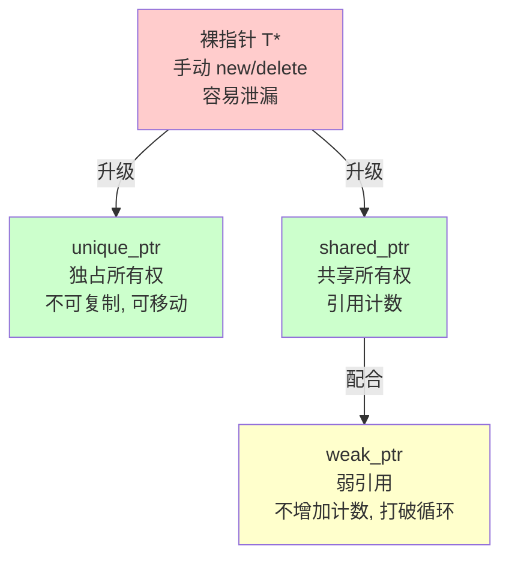

# 15. 智能指针深入

> 难度分布：🟢 入门 1 题 · 🟡 进阶 9 题 · 🔴 高难 5 题

[[toc]]

---


## 一、智能指针基础





### Q1: ⭐🟢 unique_ptr、shared_ptr、weak_ptr 分别适合什么场景？


A: 结论：`unique_ptr` 表示独占所有权，默认首选；`shared_ptr` 表示共享所有权；`weak_ptr` 用来观察 `shared_ptr` 管理对象，解决循环引用和悬空访问判断。


详细解释：


- `unique_ptr` 零额外引用计数开销，语义清晰。
- `shared_ptr` 适合多个对象共同持有同一资源。
- `weak_ptr` 不增加引用计数，需 `lock()` 后使用。
- 面试标准答法：能独占就别共享，能不用堆就别上智能指针。


代码示例：


```cpp
auto p1 = std::make_unique<int>(42);
auto p2 = std::make_shared<int>(42);
std::weak_ptr<int> wp = p2;
```


常见坑/追问：


- 不要把 `shared_ptr` 当“默认安全指针”。
- 追问：为什么 `weak_ptr` 不能直接解引用？因为对象可能已被释放。

> 💡 **面试追问**：shared_ptr 的引用计数是线程安全的吗？weak_ptr 如何打破循环引用？


### Q2: ⭐🟡 为什么推荐 make_unique / make_shared？


A: 结论：因为它们更安全、更简洁，能减少重复写 `new`，并在异常场景下更稳。`make_shared` 还通常只做一次内存分配。


详细解释：


- `make_unique&lt;T&gt;(args...)` 避免手写 `new T(...)`。
- `make_shared&lt;T&gt;(args...)` 往往把对象和控制块放在同一块内存中。
- 性能和异常安全通常优于分开 `new`。


代码示例：


```cpp
auto p = std::make_shared<MyClass>(1, 2, 3);
```


常见坑/追问：


- 如果需要自定义 deleter 或和 C API 资源深度结合，未必总能直接 `make_*`。
- 追问：`make_shared` 的潜在代价？对象和控制块同分配，若还有 `weak_ptr` 残留，整块内存释放时机可能更晚。

> 💡 **面试追问**：内存泄漏如何定位？Valgrind 和 AddressSanitizer 各自适合什么场景？


### Q3: ⭐🟡 shared_ptr 的引用计数是怎么工作的？


A: 结论：`shared_ptr` 内部有控制块，记录强引用计数和弱引用计数。强计数归零时析构对象，弱计数归零时释放控制块。


详细解释：


- 控制块通常包含：引用计数、deleter、allocator 等信息。
- 多个 `shared_ptr` 拷贝共享同一控制块。
- `weak_ptr` 只影响弱计数，不延长对象生命周期。
- 引用计数的增减通常是原子操作，存在一定性能成本。


常见坑/追问：


- `shared_ptr` 线程安全不等于“对象本身线程安全”。
- 追问：为什么高频路径滥用 `shared_ptr` 会慢？因为原子计数和控制块管理有开销。

> 💡 **面试追问**：线程池的核心参数如何调优？线程数设多少合适？


### Q4: ⭐🔴 循环引用为什么会发生？怎么解决？


A: 结论：两个或多个对象彼此用 `shared_ptr` 持有，会导致强引用计数永不归零，造成内存泄漏。解决办法是把至少一端改成 `weak_ptr`。


详细解释：


- 经典例子：父子节点、观察者、双向链表。
- 谁拥有谁要设计清楚，不要所有边都共享所有权。
- `weak_ptr` 表示“我知道你，但不拥有你”。


代码示例：


```cpp
struct B;
struct A { std::shared_ptr<B> b; };
struct B { std::weak_ptr<A> a; };
```


常见坑/追问：


- 看到泄漏别只怪 `shared_ptr`，根因通常是所有权建模错了。
- 追问：Qt 的 `QObject` 对象树和 `shared_ptr` 混用要小心什么？可能出现双重管理和析构顺序问题。

> 💡 **面试追问**：链表反转怎么实现？如何检测环？为什么实际性能不如 vector？


## 二、unique_ptr 与 shared_ptr

### Q5: ⭐🟡 unique_ptr 可以放进 STL 容器吗？


A: 结论：可以。`unique_ptr` 支持移动不支持拷贝，所以放容器时要用 move/emplace。这是现代 C++ 很常见的资源管理方式。


详细解释：


- `std::vector&lt;std::unique_ptr&lt;T&gt;&gt;` 非常常见。
- 扩容时元素通过 move 转移。
- 容器销毁时会自动销毁其中的 `unique_ptr`。


代码示例：


```cpp
std::vector<std::unique_ptr<int>> v;
v.push_back(std::make_unique<int>(1));
v.emplace_back(std::make_unique<int>(2));
```


常见坑/追问：


- 不要写 `v.push_back(p);`，除非 `std::move(p)`。
- 追问：为什么 `initializer_list` 初始化 `vector&lt;unique_ptr&lt;T&gt;&gt;` 不方便？因为 `initializer_list` 元素是 const，不支持移动。

> 💡 **面试追问**：vector 扩容时迭代器为何失效？如何用 `reserve` 优化？`std::deque` 和 `vector` 底层有何不同？


### Q6: 🟡 智能指针怎么管理 C 风格资源？


A: 结论：可以通过自定义 deleter 管理 `FILE*`、socket、`malloc` 内存、OpenSSL 对象等非 `new` 资源。关键是“释放方式要匹配申请方式”。


详细解释：


- `unique_ptr&lt;T, Deleter&gt;` 很适合独占 C 资源。
- `shared_ptr` 也支持自定义 deleter，但如果无需共享，一般优先 `unique_ptr`。
- 这是 C++ 封装 RAII 的常见方式。


代码示例：


```cpp
using FilePtr = std::unique_ptr<FILE, decltype(&fclose)>;
FilePtr fp(fopen("a.txt", "r"), &fclose);
```


常见坑/追问：


- socket 在 Linux 上用 `close`，Windows 上是 `closesocket`，别混。
- 追问：为什么不用裸指针 + finally 风格？因为 C++ 没原生 finally，RAII 更稳。

> 💡 **面试追问**：与 GC 相比 RAII 的优势是什么？异常抛出时 RAII 为何仍然可靠？


### Q7: ⭐🟡 什么是 enable_shared_from_this？


A: 结论：它让对象内部安全地拿到指向自己的 `shared_ptr`。如果一个对象已经被 `shared_ptr` 管理，不能再用 `shared_ptr(this)` 重新构造控制块，否则会双重释放。


详细解释：


- 继承 `std::enable_shared_from_this&lt;T&gt;` 后，可调用 `shared_from_this()`。
- 它依赖对象已经被某个 `shared_ptr` 托管。
- 常用于异步回调中延长自身生命周期。


代码示例：


```cpp
struct Session : std::enable_shared_from_this<Session> {
    void start() {
        auto self = shared_from_this();
        // 在异步任务中捕获 self
    }
};
```


常见坑/追问：


- 在构造函数里调用 `shared_from_this()` 是未定义/异常行为，因为控制块可能还没建立。
- 追问：`weak_from_this()` 是什么？C++17 起提供，拿 `weak_ptr` 更安全。

> 💡 **面试追问**：这个知识点在实际项目中怎么用？有没有遇到过相关 bug 或性能问题？


### Q8: ⭐🔴 shared_ptr 的线程安全边界是什么？


A: 结论：不同 `shared_ptr` 实例对同一控制块做引用计数增减通常是线程安全的，但被管理对象本身的读写不自动线程安全。


详细解释：


- 线程 A 拷贝 `shared_ptr`，线程 B 销毁 `shared_ptr`，引用计数层面通常没问题。
- 但若多个线程同时调用对象成员函数，仍需要锁或无锁同步。
- 不能因为用了 `shared_ptr` 就以为数据竞争消失。


常见坑/追问：


- `use_count()` 不是并发逻辑判断的可靠依据。
- 追问：原子化 `shared_ptr` 怎么做？C++20 有 `std::atomic&lt;std::shared_ptr&lt;T&gt;&gt;` 支持。

> 💡 **面试追问**：线程池的核心参数如何调优？线程数设多少合适？


### Q9: 🟡 Qt 里为什么很多时候不建议用智能指针管理 QObject？


A: 结论：因为 `QObject` 已经有 parent-child 对象树管理生命周期，再叠加智能指针容易形成双重所有权、析构顺序冲突。Qt 对象通常遵循 Qt 自己的生命周期模型。


详细解释：


- 有 parent 的 QObject 往往由父对象析构时统一释放。
- 若再塞进 `shared_ptr`/`unique_ptr`，很容易二次 delete。
- 但对无 parent、非 QObject 资源封装对象，智能指针仍然很好用。


常见坑/追问：


- `QObject::deleteLater()` 和 `shared_ptr` deleter 混用更要谨慎。
- 追问：那 Qt 场景下完全不能用智能指针吗？不是，关键看是否与对象树冲突。

> 💡 **面试追问**：shared_ptr 的引用计数是线程安全的吗？weak_ptr 如何打破循环引用？


## 三、weak_ptr 与循环引用

### Q10: ⭐🔴 智能指针最大的面试陷阱是什么？


A: 结论：最大的陷阱不是 API 记不住，而是所有权模型说不清。面试官真正想听的是：谁创建、谁拥有、谁释放、是否共享、是否跨线程、是否循环引用。


详细解释：


- 先建模所有权，再选指针。
- 如果对象天然唯一拥有，用 `unique_ptr`。
- 如果多个组件共同持有且生命周期交织，才考虑 `shared_ptr`。
- 如果只是引用观察，不拥有，就用裸指针/引用/`weak_ptr`，视场景而定。


常见坑/追问：


- “统一全用 `shared_ptr` 最安全”是非常典型的错误回答。
- 追问：什么时候裸指针仍然合理？当它只表达非拥有关系时。

> 💡 **面试追问**：shared_ptr 的引用计数是线程安全的吗？weak_ptr 如何打破循环引用？


### Q11: ⭐🟡 `std::unique_ptr` 的自定义删除器怎么用？有什么应用场景？


A: 结论：`unique_ptr<T, Deleter>` 接受第二模板参数作为删除器类型，可用于管理非 `new` 分配的资源（如文件句柄、SDL_Surface、C API 资源），实现 RAII 统一管理。


详细解释：


- 函数指针删除器：`unique_ptr<FILE, decltype(&fclose)> f(fopen(...), &fclose);`
- Lambda 删除器：`unique_ptr<T, decltype(deleter)> p(raw, deleter);`
- 自定义 Functor：定义 `operator()` 的结构体，可携带额外状态。
- 删除器存储在 `unique_ptr` 内部，空基类优化（EBO）可使无状态删除器不占用额外空间。


代码示例：


```cpp
// 管理 C 文件句柄
auto closer = [](FILE* f){ if (f) fclose(f); };
std::unique_ptr<FILE, decltype(closer)> fp(fopen("test.txt", "r"), closer);

// 管理 C API 资源
struct SDLDeleter { void operator()(SDL_Surface* s) { SDL_FreeSurface(s); } };
std::unique_ptr<SDL_Surface, SDLDeleter> surface(SDL_LoadBMP("img.bmp"));
```


常见坑/追问：


- Lambda 删除器每个 lambda 是唯一类型，如果需要存入容器需用 `std::function`（有开销）。
- 追问：`shared_ptr` 的删除器和 `unique_ptr` 有何不同？`shared_ptr` 删除器类型擦除，存在 control block 里，不影响 `shared_ptr<T>` 的类型；`unique_ptr` 删除器是类型的一部分。


---

> 💡 **面试追问**：与 GC 相比 RAII 的优势是什么？异常抛出时 RAII 为何仍然可靠？


### Q12: ⭐🔴 `std::shared_ptr` 的控制块（Control Block）里有什么？


A: 结论：控制块包含引用计数（strong count）、弱引用计数（weak count）、删除器、分配器，以及可能的对象本身（`make_shared` 时合并分配）。


详细解释：


- **strong count**：`shared_ptr` 的数量；归零时调用删除器销毁对象。
- **weak count**：`weak_ptr` 的数量 + 1（+1 是 strong count > 0 时的额外引用，防控制块提前释放）；归零时释放控制块内存。
- `make_shared`：对象和控制块一次分配（一次 `new`），cache 友好；代价是对象不能提前释放（即使 strong count = 0，若 weak count > 0 内存不释放）。
- `shared_ptr(new T)`：两次分配，但对象可提前释放。


常见坑/追问：


- `make_shared` 和大对象 + 长生命周期 `weak_ptr` 配合时会导致内存"迟释"，需权衡。
- 追问：`enable_shared_from_this` 原理是什么？基类内部有 `weak_ptr<T> weak_this_`，`shared_from_this()` 通过它构造 `shared_ptr`，避免 double-delete。


---

> 💡 **面试追问**：内存泄漏如何定位？Valgrind 和 AddressSanitizer 各自适合什么场景？


## 四、自定义与陷阱

### Q13: ⭐🟡 什么时候用 `std::weak_ptr`？它如何打破循环引用？


A: 结论：`weak_ptr` 用于"观察"对象但不拥有它，不增加强引用计数；循环引用中将其中一方换成 `weak_ptr`，循环所有权链断裂，对象能正常销毁。


详细解释：


- 循环引用：A 持有 `shared_ptr<B>`，B 持有 `shared_ptr<A>`，两者 strong count 永远 ≥ 1，内存泄漏。
- 解决：将 B 持有的改为 `weak_ptr<A>`；A 销毁时 B 持有的 weak_ptr 自动失效（`expired() == true`）。
- `weak_ptr::lock()` 返回 `shared_ptr<T>`，若对象已销毁则返回 `nullptr`。
- 缓存、观察者等"临时引用"场景天然适合 `weak_ptr`。


代码示例：


```cpp
struct B;
struct A {
    std::shared_ptr<B> b;
};
struct B {
    std::weak_ptr<A> a; // 打破循环
};
auto a = std::make_shared<A>();
auto b = std::make_shared<B>();
a->b = b; b->a = a;
// 现在 a 和 b 都能正常析构
```


常见坑/追问：


- `lock()` 得到的 `shared_ptr` 要及时使用，不要长时间持有，否则又变成循环。
- 追问：`weak_ptr` 能用于多线程吗？`lock()` 是原子操作，线程安全；但得到 `shared_ptr` 后的操作不受额外保护。


---

> 💡 **面试追问**：线程池的核心参数如何调优？线程数设多少合适？


### Q14: ⭐🔴 智能指针在多线程下是线程安全的吗？


A: 结论：`shared_ptr` 的引用计数操作是原子的（线程安全），但对 `shared_ptr` 对象本身的读写（赋值、拷贝等）不是线程安全的；指向的对象的访问需要自行加锁。


详细解释：


- 安全：多个线程同时持有各自的 `shared_ptr` 副本（独立拷贝）→ 引用计数原子增减，没问题。
- 不安全：多个线程同时对**同一个 `shared_ptr` 对象**（同一个变量）读写 → 数据竞争，UB。
- 对象本身：`shared_ptr` 不提供任何指向对象的线程安全保障，需要 mutex 或原子操作。
- C++20 `std::atomic<shared_ptr<T>>`：允许原子地替换 `shared_ptr`，安全跨线程共享指针变量。


代码示例：


```cpp
// 安全：每个线程有自己的副本
void thread_func(std::shared_ptr<Data> d) { // 按值传递，独立副本
    d->process();
}
// 不安全：共享同一个 shared_ptr 变量
std::shared_ptr<Data> shared;
// thread1: shared = newData; thread2: auto d = shared; → 数据竞争！
```


常见坑/追问：


- "引用计数是原子的所以线程安全"是非常常见的误解，安全的只是计数，不是指针本身。
- 追问：如何跨线程安全地替换 `shared_ptr`？C++20 `std::atomic<shared_ptr<T>>` 或加 mutex 保护。


---

> 💡 **面试追问**：shared_ptr 的引用计数是线程安全的吗？weak_ptr 如何打破循环引用？


### Q15: ⭐🟡 `std::make_shared` 和 `std::shared_ptr<T>(new T)` 有什么区别？什么时候必须用后者？


A: 结论：`make_shared` 一次分配对象和控制块（高效、异常安全），推荐优先使用；但需要自定义删除器、或对象大且有大量长生命周期 `weak_ptr` 时，用 `shared_ptr<T>(new T, deleter)` 更合适。


详细解释：


- `make_shared` 优势：一次内存分配，cache 友好，异常安全（无裸 `new`）。
- `make_shared` 劣势：对象和控制块合并，strong count = 0 但 weak count > 0 时内存无法提前释放。
- 必须用构造函数的情况：需要自定义删除器（`make_shared` 不支持）；需要 `private` 构造函数时（需 friend）；从裸指针接管所有权时。


代码示例：


```cpp
// 需要自定义删除器，必须手动构造
auto p = std::shared_ptr<FILE>(fopen("a.txt", "r"),
                                [](FILE* f){ if(f) fclose(f); });
// 一般情况优先用 make_shared
auto obj = std::make_shared<MyClass>(arg1, arg2);
```


常见坑/追问：


- `make_shared` 需要访问构造函数，`private` 构造时需要在类内声明 `friend`。
- 追问：`std::allocate_shared` 是什么？允许指定自定义分配器（如内存池），适合高性能场景。

---

> 💡 **面试追问**：内存泄漏如何定位？Valgrind 和 AddressSanitizer 各自适合什么场景？

---

## 📊 本章统计

| 指标 | 数量 |
|------|------|
| 总题目数 | 15 |
| 🟢 入门 | 1 |
| 🟡 进阶 | 9 |
| 🔴 高难 | 5 |
