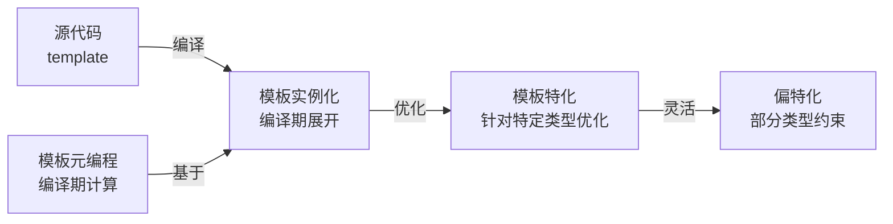

# 20. 模板与泛型编程

> 难度分布：🟢 入门 1 题 · 🟡 进阶 6 题 · 🔴 高难 8 题

[[toc]]

---


## 一、模板基础





### Q1: ⭐🟢 模板的本质是什么？


A: 结论：模板本质上是编译期代码生成与泛型抽象机制。它不是简单“类型占位符”，而是让编译器按类型/值实例化出具体代码。


详细解释：


- 函数模板、类模板是最常见形式。
- 模板让算法与类型解耦，例如 `std::sort` 可作用于多种迭代器。
- 代价是编译错误复杂、编译时间变长、二进制可能膨胀。


代码示例：


```cpp
template <typename T>
T add(T a, T b) { return a + b; }
```


常见坑/追问：


- 模板不是运行时多态，实例化发生在编译期。
- 追问：模板和宏区别？模板有类型系统、作用域、可调试性更强。

> 💡 **面试追问**：模板编译期展开有什么代价？如何减少模板实例化导致的代码膨胀？


### Q2: ⭐🟡 模板实例化是什么时候发生的？


A: 结论：模板通常在编译期按需实例化：当你真正用到某个模板参数组合时，编译器才生成对应代码。


详细解释：


- 只声明不用，不一定实例化。
- 类模板成员函数也通常按需实例化。
- 这也是模板定义常放头文件的原因：编译单元需要看到完整定义才能实例化。


常见坑/追问：


- 把模板实现放 cpp 而不显式实例化，常导致链接错误。
- 追问：显式实例化能干嘛？可减少重复实例化，控制编译边界。

> 💡 **面试追问**：模板编译期展开有什么代价？如何减少模板实例化导致的代码膨胀？


### Q3: ⭐🔴 函数模板重载、特化、普通函数优先级怎么理解？


A: 结论：编译器会先做重载决议，再考虑模板匹配和特化。一般普通函数优先于同样匹配的模板，特化是对某些模板参数的定制版本。


详细解释：


- 函数模板可以重载。
- 类模板支持偏特化，函数模板不支持偏特化。
- 函数模板的“看起来像偏特化”通常通过重载实现。


代码示例：


```cpp
void f(int);

template <typename T>
void f(T);
```


常见坑/追问：


- “函数模板也能偏特化”是高频错误答案。
- 追问：那函数模板想做类似偏特化怎么办？靠重载 + SFINAE/concepts。

> 💡 **面试追问**：模板编译期展开有什么代价？如何减少模板实例化导致的代码膨胀？


### Q4: ⭐🔴 全特化和偏特化分别是什么？


A: 结论：全特化是把模板参数全部确定；偏特化是只对一部分模式进行特殊处理。类模板支持二者，函数模板只支持全特化，不支持偏特化。


详细解释：


- 全特化：`Template&lt;int, double&gt;` 这种完全写死。
- 偏特化：`Template&lt;T*&gt;`、`Template&lt;std::vector&lt;T&gt;&gt;` 这种针对模式。
- STL 大量使用偏特化和 traits 技术。


代码示例：


```cpp
template <typename T>
struct Traits { static constexpr bool is_ptr = false; };

template <typename T>
struct Traits<T*> { static constexpr bool is_ptr = true; };
```


常见坑/追问：


- 偏特化容易和重载混淆，尤其函数模板场景。
- 追问：为什么 traits 常用偏特化？因为它天生适合按类型模式分类。

> 💡 **面试追问**：vector 扩容时迭代器为何失效？如何用 `reserve` 优化？`std::deque` 和 `vector` 底层有何不同？


### Q5: ⭐🔴 什么是 SFINAE？


A: 结论：SFINAE（Substitution Failure Is Not An Error）指模板参数替换失败时，不直接报错，而是把该模板候选从重载集中移除。这是 C++11~17 泛型约束的核心技巧之一。


详细解释：


- 常见工具：`std::enable_if`、`void_t`、检测惯用法（detection idiom）。
- 用途：根据类型特征启用/禁用某个模板重载。
- 它让“只有满足某条件的类型才能调用某函数”成为可能。


代码示例：


```cpp
template <typename T,
          typename = std::enable_if_t<std::is_integral_v<T>>>
void foo(T) {}
```


常见坑/追问：


- SFINAE 错误信息往往很长，维护成本不低。
- 追问：C++20 有什么更好的替代？concepts。

> 💡 **面试追问**：模板编译期展开有什么代价？如何减少模板实例化导致的代码膨胀？


## 二、模板特化与偏特化

### Q6: ⭐🟡 type_traits 是什么？有什么用？


A: 结论：`&lt;type_traits&gt;` 提供编译期类型判断和变换工具，是模板元编程基础设施。没有它，很多泛型约束和优化都得手搓。


详细解释：


- 判断类：`is_same`、`is_integral`、`is_base_of`。
- 变换类：`remove_reference`、`decay`、`conditional`。
- 常与 `if constexpr`、SFINAE、concepts 搭配使用。


代码示例：


```cpp
static_assert(std::is_integral_v<int>);
using T = std::remove_reference_t<int&>;
```


常见坑/追问：


- `std::is_same&lt;T, U&gt;::value` 在 C++17 后通常可写成 `_v` 变量模板更简洁。
- 追问：`decay` 做了什么？大致类似函数传参时的类型退化。

> 💡 **面试追问**：模板编译期展开有什么代价？如何减少模板实例化导致的代码膨胀？


### Q7: ⭐🟡 什么是变参模板（variadic templates）？


A: 结论：变参模板允许模板接收任意数量参数，是现代 C++ 实现通用打印、完美转发工厂、tuple 等能力的核心机制。


详细解释：


- 通过参数包 `typename... Ts`、`Ts... args` 表示。
- 常配合展开表达式（fold expressions）或递归展开。
- 它替代了 C 风格 `...` 可变参数的很多场景。


代码示例：


```cpp
template <typename... Args>
void log(Args&&... args) {
    (std::cout << ... << args) << '\n';
}
```


常见坑/追问：


- 参数包展开位置和语法很容易第一次写懵。
- 追问：C++17 对它的改进？fold expressions 让展开更优雅。

> 💡 **面试追问**：模板编译期展开有什么代价？如何减少模板实例化导致的代码膨胀？


### Q8: ⭐🔴 什么是完美转发？它和模板有什么关系？


A: 结论：完美转发是指在模板中保留实参的值类别（左值/右值）并转发给下游函数，核心工具是转发引用 + `std::forward`。


详细解释：


- `T&amp;&amp;` 在模板推导场景下可能是 forwarding reference。
- 左值传入时 T 推导为 `U&amp;`，右值传入时 T 推导为 `U`。
- `std::forward&lt;T&gt;(arg)` 能保留原始值类别。
- 工厂函数、emplace 系列 heavily rely on it。


代码示例：


```cpp
template <typename T, typename... Args>
std::unique_ptr<T> make_obj(Args&&... args) {
    return std::make_unique<T>(std::forward<Args>(args)...);
}
```


常见坑/追问：


- `std::move` 和 `std::forward` 不能乱替换。
- 追问：什么情况下 `T&amp;&amp;` 不是转发引用？当 T 不是模板推导来的，比如类模板已确定类型时。

> 💡 **面试追问**：模板编译期展开有什么代价？如何减少模板实例化导致的代码膨胀？


### Q9: ⭐🔴 concepts 是什么？为什么说它改善了模板可读性？


A: 结论：concepts 是 C++20 引入的模板约束机制，用来明确表达“这个模板参数必须满足什么能力”。它让错误信息和接口意图都比 SFINAE 更清晰。


详细解释：


- 可以用标准 concepts，如 `std::integral`、`std::ranges::range`。
- 也可自定义 concept。
- 它本质上仍是编译期约束，但语法更直接。


代码示例：


```cpp
#include <concepts>

template <std::integral T>
T gcd(T a, T b) {
    while (b != 0) {
        T t = a % b;
        a = b;
        b = t;
    }
    return a;
}
```


常见坑/追问：


- concepts 改善的是约束表达和诊断体验，不代表模板复杂度自动消失。
- 追问：它和 `static_assert` 区别？concept 是接口层约束，`static_assert` 更像内部断言。

> 💡 **面试追问**：模板编译期展开有什么代价？如何减少模板实例化导致的代码膨胀？


### Q10: ⭐🔴 泛型编程最容易写成什么样的“高级灾难”？


A: 结论：最容易写成“抽象很炫、报错很长、没人敢改”的模板黑魔法。泛型的目标应是复用和约束清晰，而不是炫技。


详细解释：


- 先确认是否真有多类型复用需求。
- 优先简单模板 + traits + `if constexpr`。
- 必要时再上 SFINAE / concepts / 元编程。
- 过度模板化会拖慢编译、放大错误信息、增加维护成本。


常见坑/追问：


- 面试官如果问“你如何控制模板复杂度”，最好答：限制抽象层级、补静态测试、用 concepts 提升接口可读性。
- 追问：什么时候不用模板更好？当实现只有一种类型、变化不值得抽象时。

> 💡 **面试追问**：模板编译期展开有什么代价？如何减少模板实例化导致的代码膨胀？


## 三、模板元编程

### Q11: ⭐🟡 什么是模板偏特化（Partial Specialization）？有什么应用？


A: 结论：模板偏特化允许对模板参数的一部分进行特殊处理，比全特化更灵活；常用于 `std::is_pointer`、`std::vector<bool>` 特化、类型萃取等场景。


详细解释：


- 全特化：所有模板参数都固定，`template<> struct Foo<int> {};`
- 偏特化：只固定部分参数，`template<T> struct Foo<T*> {};`（所有指针类型特化）
- 函数模板不支持偏特化（只支持全特化），通常用重载代替。
- 类模板偏特化广泛用于 `std::is_xxx` 类型 traits、`std::tuple_element` 等。


代码示例：


```cpp
// 通用模板
template<typename T> struct TypeName { static const char* name() { return "unknown"; } };
// 偏特化：所有指针类型
template<typename T> struct TypeName<T*> { static const char* name() { return "pointer"; } };
// 偏特化：const 类型
template<typename T> struct TypeName<const T> { static const char* name() { return "const"; } };

TypeName<int*>::name();   // "pointer"
TypeName<const float>::name(); // "const"
```


常见坑/追问：


- 偏特化和全特化的匹配优先级：全特化 > 偏特化 > 主模板。
- 追问：为什么 `std::vector<bool>` 是特化版本？早期优化存储（每 bit 存一个 bool），但引入了与普通 vector 不兼容的行为，现在被认为是设计失误。


---

> 💡 **面试追问**：vector 扩容时迭代器为何失效？如何用 `reserve` 优化？`std::deque` 和 `vector` 底层有何不同？


### Q12: ⭐🟡 `std::enable_if` 的作用和原理是什么？


A: 结论：`std::enable_if` 利用 SFINAE（替换失败不是错误）在编译期根据条件启用或禁用模板重载；条件为 false 时该重载从候选集中移除，而不是报错。


详细解释：


- `enable_if<condition, T>::type`：condition 为 true 时 `type = T`，false 时无 `type`（SFINAE 触发）。
- 用于函数返回类型、模板参数默认值或函数参数中。
- C++20 Concepts 提供了更清晰的语法替代 `enable_if`，错误信息更友好。


代码示例：


```cpp
// 只对整数类型启用
template<typename T>
std::enable_if_t<std::is_integral_v<T>, T>
add(T a, T b) { return a + b; }

// C++20 等价（更清晰）
template<std::integral T>
T add(T a, T b) { return a + b; }
```


常见坑/追问：


- `enable_if` 放在返回类型上最通用，放在模板参数默认值上有时更简洁。
- 追问：SFINAE 和硬错误（hard error）的区别？SFINAE 只在"直接上下文"中触发，函数体内的编译失败是硬错误，不会静默排除。


---

> 💡 **面试追问**：模板编译期展开有什么代价？如何减少模板实例化导致的代码膨胀？


### Q13: ⭐🔴 可变参数模板（Variadic Templates）和折叠表达式如何使用？


A: 结论：可变参数模板用 `typename... Args` 接受任意数量类型参数，C++17 折叠表达式（`(... + args)`）简化了对参数包的运算，无需递归展开。


详细解释：


- 参数包展开：递归（C++11/14）或折叠表达式（C++17）。
- 折叠表达式：`(args + ...)` 等价于 `a + (b + (c + d))`（右折叠）；`(... + args)` 左折叠。
- 应用：`std::make_tuple`、`std::apply`、日志库、类型列表操作。


代码示例：


```cpp
// 求和（折叠表达式）
template<typename... Args>
auto sum(Args... args) { return (... + args); } // 左折叠

// 打印所有参数
template<typename... Args>
void print(Args&&... args) {
    (std::cout << ... << args) << '\n'; // 折叠表达式
}

print(1, " hello ", 3.14); // "1 hello 3.14"
```


常见坑/追问：


- 空参数包的折叠表达式：某些运算符有 identity 值（`+` → 0，`&&` → true），但其他运算符空包会编译错误。
- 追问：如何统计参数包大小？`sizeof...(Args)`，编译期常量。


---

> 💡 **面试追问**：模板编译期展开有什么代价？如何减少模板实例化导致的代码膨胀？


### Q14: ⭐🔴 `if constexpr` 和普通 `if` 有什么区别？


A: 结论：`if constexpr` 是编译期条件分支，未选中的分支不参与代码生成（但仍需语法正确）；普通 `if` 两个分支都编译，仅运行时选择路径。


详细解释：


- `if constexpr`：条件必须是编译期常量表达式；false 分支即使类型不匹配也不报错（前提是语法合法）。
- 用途：模板函数中根据类型属性生成不同代码，替代 SFINAE 和标签分发，代码更清晰。
- `if constexpr` + `requires`（C++20）：更细粒度的条件编译。


代码示例：


```cpp
template<typename T>
std::string toString(T val) {
    if constexpr (std::is_same_v<T, std::string>) {
        return val; // 只有 T=string 时才编译这行
    } else if constexpr (std::is_arithmetic_v<T>) {
        return std::to_string(val);
    } else {
        return "unknown";
    }
}
```


常见坑/追问：


- `if constexpr` 的 false 分支仍需语法合法（只是不实例化），完全无关的语法错误还是会报错。
- 追问：`if constexpr` 和 `#ifdef` 的区别？后者是预处理阶段，不感知类型；前者是编译期 C++，可以用类型 traits，更安全。


---

> 💡 **面试追问**：模板编译期展开有什么代价？如何减少模板实例化导致的代码膨胀？


### Q15: ⭐🟡 类型萃取（Type Traits）在实际项目中有哪些典型应用？


A: 结论：类型萃取用于编译期类型检查和条件特化，常见应用：序列化/反序列化按类型选路径、内存拷贝优化（is_trivially_copyable → memcpy）、容器元素约束、日志系统格式化。


详细解释：


- `std::is_trivially_copyable_v<T>`：true 时用 `memcpy` 批量拷贝，false 时逐元素构造，性能关键。
- `std::is_integral_v<T>` + `if constexpr`：序列化时整数直接写二进制，非整数用特殊处理。
- `std::underlying_type_t<EnumType>`：安全地取枚举底层类型，用于位操作。
- `std::conditional_t<condition, T1, T2>`：编译期三目运算符，选择类型。


代码示例：


```cpp
template<typename T>
void serialize(const T& val, std::vector<uint8_t>& buf) {
    if constexpr (std::is_trivially_copyable_v<T>) {
        auto* p = reinterpret_cast<const uint8_t*>(&val);
        buf.insert(buf.end(), p, p + sizeof(T));
    } else {
        val.serialize(buf); // 调用自定义序列化
    }
}
```


常见坑/追问：


- `is_trivially_copyable` 不代表 POD，要小心虚函数基类（不 trivially copyable）。
- 追问：`std::decay_t<T>` 是什么？去掉引用、CV 限定和数组/函数到指针退化，常用于获取"裸"类型。

---

> 💡 **面试追问**：vector 扩容时迭代器为何失效？如何用 `reserve` 优化？`std::deque` 和 `vector` 底层有何不同？

---

## 📊 本章统计

| 指标 | 数量 |
|------|------|
| 总题目数 | 15 |
| 🟢 入门 | 1 |
| 🟡 进阶 | 6 |
| 🔴 高难 | 8 |
