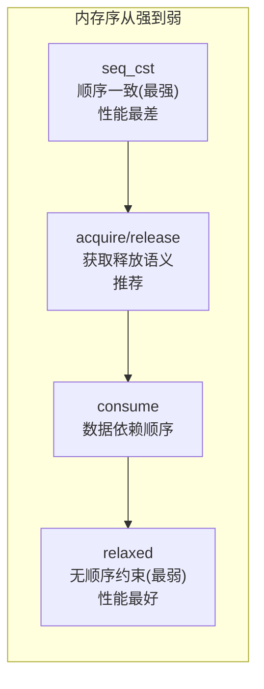

# 25. C++ 内存模型与原子操作

> 难度分布：🟢 入门 1 题 · 🟡 进阶 9 题 · 🔴 高难 5 题

[[toc]]

---


## 一、内存序基础




> 选择原则：默认用 `seq_cst`，性能敏感时改为 `acquire/release`，纯计数器用 `relaxed`。


### Q1: ⭐🟢 什么是数据竞争（data race）？


A: 结论：两个线程同时访问同一内存位置，至少一个是写，且没有同步关系，这就是数据竞争，行为未定义。


详细解释：


- C++ 内存模型的底线之一就是：有 data race，程序就不再受语言保证。
- 这不是“偶尔出错”，而是整个优化前提都失效。


常见坑/追问：


- `volatile` 不能解决线程同步问题。

> 💡 **面试追问**：线程池的核心参数如何调优？线程数设多少合适？


### Q2: ⭐🟡 std::atomic 能保证什么？不能保证什么？


A: 结论：`std::atomic` 能保证单个原子对象操作的原子性和指定内存序语义，但不能自动保证复合逻辑整体线程安全。


详细解释：


- `++counter` 对 atomic 可以是原子操作。
- 但“先检查再操作”这种复合逻辑仍可能竞态。
- 原子不等于无锁算法自动正确。


代码示例：


```cpp
std::atomic<int> counter{0};
counter.fetch_add(1, std::memory_order_relaxed);
```


常见坑/追问：


- 单个变量原子，不代表整个对象状态一致。

> 💡 **面试追问**：线程池的核心参数如何调优？线程数设多少合适？


### Q3: ⭐🟡 memory_order 应该怎么理解？


A: 结论：`memory_order` 决定原子操作对编译器和 CPU 重排的约束强度，本质是在性能与可见性之间做权衡。


详细解释：


- `relaxed`：只保原子性，不保顺序。
- `acquire/release`：建立同步边，适合发布-订阅。
- `seq_cst`：最强、最直观，但代价更高。
- `acq_rel`：读改写操作常用。


代码示例：


```cpp
flag.store(true, std::memory_order_release);
if (flag.load(std::memory_order_acquire)) {
    // 能看到 release 前写入的数据
}
```


常见坑/追问：


- 别把 `memory_order` 背成口诀，要能说出“谁和谁建立 happens-before”。

> 💡 **面试追问**：这个知识点在实际项目中怎么用？有没有遇到过相关 bug 或性能问题？


### Q4: ⭐🟡 CAS 是什么？什么时候适合用？


A: 结论：CAS（Compare-And-Swap / Compare-Exchange）是无锁编程核心原语，适合实现计数器、无锁栈、状态位切换等轻量竞争场景。


详细解释：


- CAS 比较当前值是否等于期望值，若相等则写入新值。
- 失败时通常需要循环重试。
- 竞争激烈时，自旋重试可能比加锁更差。


代码示例：


```cpp
std::atomic<int> x{0};
int expected = 0;
x.compare_exchange_strong(expected, 1, std::memory_order_acq_rel);
```


常见坑/追问：


- 追问常见：ABA 问题是什么？值看起来没变，但中间可能经历过变化。

> 💡 **面试追问**：互斥锁和自旋锁各自适合什么场景？如何避免死锁？


## 二、原子操作

### Q5: 🟡 memory_order_relaxed 能用在哪？


A: 结论：适合只关心原子性、不关心与其他内存访问先后关系的统计类场景，如计数器、监控指标。


详细解释：


- 比如 QPS 统计、命中数统计。
- 若该变量承载“发布数据是否可见”的语义，就不能只用 relaxed。


常见坑/追问：


- relaxed 不是“更高级”，而是“约束更少、风险更高”。

> 💡 **面试追问**：内存泄漏如何定位？Valgrind 和 AddressSanitizer 各自适合什么场景？


### Q6: 🟡 什么是 happens-before？


A: 结论：happens-before 是 C++ 内存模型里的可见性与顺序关系，只要 A happens-before B，就能认为 B 能看到 A 的效果。


详细解释：


- 线程内顺序、锁解锁、release/acquire 配对都能建立这种关系。
- 回答这题时，别只说定义，最好举个发布配置数据的例子。


常见坑/追问：


- “先执行”不等于“对另一个线程可见”。

> 💡 **面试追问**：线程池的核心参数如何调优？线程数设多少合适？


### Q7: 🔴 为什么双重检查锁（DCLP）历史上容易写错？


A: 结论：因为对象构造和指针发布可能发生重排，另一个线程可能读到“非空但未完全构造”的对象。现代 C++ 需配合正确原子语义或直接用局部静态初始化。


详细解释：


- 经典单例若只靠普通指针判断，很容易踩内存重排坑。
- C++11 后函数内局部静态变量初始化线程安全，通常更推荐。


代码示例：


```cpp
My& instance() {
    static My obj;
    return obj;
}
```


常见坑/追问：


- 面试里直接给出“优先局部静态单例”通常很稳。

> 💡 **面试追问**：线程池的核心参数如何调优？线程数设多少合适？


### Q8: 🔴 无锁一定比加锁快吗？


A: 结论：不一定。无锁只是避免阻塞，不代表总吞吐更高；在高竞争、缓存抖动、伪共享严重时可能更慢。


详细解释：


- 原子操作会触发 cache coherence 流量。
- 自旋失败重试本身也烧 CPU。
- 真实工程里常是“热点小状态用 atomic，大临界区用锁”。


常见坑/追问：


- 高级一点可提伪共享、backoff、NUMA 影响。

> 💡 **面试追问**：互斥锁和自旋锁各自适合什么场景？如何避免死锁？


## 三、内存屏障与 happens-before

### Q9: ⭐🟡 `memory_order_relaxed` 适合什么场景？


A: 结论：`relaxed` 只保证操作原子性，不建立任何跨线程同步关系，适合纯计数器（统计用途）、单线程读写的原子标志等不需要顺序保证的场景。


详细解释：


- `relaxed` 是开销最小的内存序，允许编译器和 CPU 重排指令。
- 它只保证"对该原子变量的操作是原子的"，不保证其他内存操作的可见顺序。
- 典型用途：`std::shared_ptr` 的引用计数递增用 `relaxed`（只需要原子性）；递减用 `acq_rel`（需要同步，确保析构前能看到所有修改）。
- 错误用途：用 `relaxed` 的 flag 来保护其他共享数据的访问，无效。


代码示例：


```cpp
std::atomic<int> hitCount{0};

void onRequest() {
    // 只需要原子递增，不需要和其他内存操作同步
    hitCount.fetch_add(1, std::memory_order_relaxed);
}

int getHitCount() {
    return hitCount.load(std::memory_order_relaxed);
}
```


常见坑/追问：


- `relaxed` 不能替代 `release`/`acquire`，用错会导致数据竞争（race condition）。
- 追问：`shared_ptr` 引用计数为何递增用 `relaxed`？因为引用计数本身是幂等的，只需原子性；销毁时才需要同步。

> 💡 **面试追问**：线程池的核心参数如何调优？线程数设多少合适？


### Q10: ⭐🟡 `acquire`/`release` 语义是如何建立"happens-before"关系的？


A: 结论：`release` 写保证其之前的所有操作对执行 `acquire` 读同一变量的线程可见；两者配对在线程间建立 happens-before 关系。


详细解释：


- `release`（store）：该 store 之前的所有内存操作不会被重排到 store 之后（写屏障）。
- `acquire`（load）：该 load 之后的所有内存操作不会被重排到 load 之前（读屏障）。
- 当线程 B 的 `acquire` load 读到了线程 A 的 `release` store 写入的值，则 A 在 store 前的所有操作对 B 在 load 后都可见。
- 这是实现"发布-订阅"（publish-subscribe）共享数据的基础。


代码示例：


```cpp
std::atomic<bool> ready{false};
int data = 0;

// 生产者线程
void producer() {
    data = 42;                                         // (1)
    ready.store(true, std::memory_order_release);      // (2) release：(1) 不会排到 (2) 后
}

// 消费者线程
void consumer() {
    while (!ready.load(std::memory_order_acquire)) {}  // (3) acquire
    // (3) 读到了 (2) 写的 true
    // happens-before 保证：(1) 对消费者在 (3) 后可见
    assert(data == 42); // 安全
}
```


常见坑/追问：


- `acq_rel` 用于 RMW 操作（fetch_add 等），同时具有 acquire 和 release 语义。
- 追问：`seq_cst` 是最强的内存序，所有线程观察到所有 `seq_cst` 操作的顺序一致，但也最昂贵。

> 💡 **面试追问**：线程池的核心参数如何调优？线程数设多少合适？


### Q11: 🟡 什么是 `volatile` 在 C++ 中的正确用途？为什么它不能用于线程同步？


A: 结论：`volatile` 告知编译器不要优化该变量的访问（每次都实际读写内存），用于硬件寄存器、内存映射 I/O、`setjmp`/`longjmp` 等；它不提供原子性也不提供内存序，不能用于线程同步。


详细解释：


- `volatile` 防止编译器缓存变量到寄存器，但 CPU 的缓存一致性（cache coherence）和指令重排不受影响。
- 两个线程读写 `volatile int` 仍然是数据竞争（UB）。
- Java/C# 的 `volatile` 有内存序语义，但 C++ 的 `volatile` 没有，不要混淆。
- 嵌入式场景：内存映射寄存器用 `volatile`，确保每次读写都真正发送到硬件。


代码示例：


```cpp
// 正确用途：内存映射寄存器
volatile uint32_t* const TIMER_REG = reinterpret_cast<uint32_t*>(0x40000000);
uint32_t tick = *TIMER_REG; // 每次都真实读硬件寄存器

// 错误用途：线程同步（不安全！）
volatile bool flag = false; // 仍有数据竞争，不能替代 std::atomic<bool>
```


常见坑/追问：


- MSVC 曾给 `volatile` 添加了 acquire/release 语义（扩展），但这是 MSVC 特有行为，不可移植。
- 追问：`std::atomic<T>` 加上 `relaxed` 序比 `volatile` 更强（原子性），加上合适内存序才有同步语义。

> 💡 **面试追问**：线程池的核心参数如何调优？线程数设多少合适？


### Q12: ⭐🔴 如何实现一个无锁的 SPSC 队列？


A: 结论：SPSC（Single Producer Single Consumer）队列利用 `relaxed`/`release`/`acquire` 原子操作和固定大小环形缓冲区实现，是无锁编程中最简单且高效的结构。


详细解释：


- head（消费者）和 tail（生产者）分别原子维护，互不干扰。
- 生产者 push：用 `release` store 更新 tail，确保数据写入对消费者可见。
- 消费者 pop：用 `acquire` load 读 tail，再用 `release` store 更新 head。
- 两者各自的索引用 `relaxed` 读（因为只有自己修改）。
- 需要 `alignas(64)` 避免 head/tail 在同一 cache line 导致伪共享。


代码示例：


```cpp
template<typename T, size_t Cap>
class SPSCQueue {
    T buf[Cap];
    alignas(64) std::atomic<size_t> head{0};
    alignas(64) std::atomic<size_t> tail{0};
public:
    bool push(T val) {
        size_t t = tail.load(std::memory_order_relaxed);
        size_t next = (t + 1) % Cap;
        if (next == head.load(std::memory_order_acquire)) return false; // 满
        buf[t] = std::move(val);
        tail.store(next, std::memory_order_release);
        return true;
    }
    bool pop(T& val) {
        size_t h = head.load(std::memory_order_relaxed);
        if (h == tail.load(std::memory_order_acquire)) return false; // 空
        val = std::move(buf[h]);
        head.store((h + 1) % Cap, std::memory_order_release);
        return true;
    }
};
```


常见坑/追问：


- SPSC 队列的无锁性依赖单生产者单消费者，多生产者需要 CAS 或加锁。
- 追问：伪共享（false sharing）：head 和 tail 要放不同 cache line，否则生产/消费互相 invalidate 对方的 cache line，性能崩溃。

> 💡 **面试追问**：互斥锁和自旋锁各自适合什么场景？如何避免死锁？


## 四、无锁编程

### Q13: 🟡 `std::mutex` 和 `std::recursive_mutex` 有什么区别？什么时候需要 recursive_mutex？


A: 结论：`recursive_mutex` 允许同一线程多次加锁（不死锁），计数归零后才真正释放；通常出现在递归调用或回调场景，但一般视为代码设计问题的信号。


详细解释：


- `std::mutex` 同一线程二次加锁是 UB（通常死锁或未定义）。
- `recursive_mutex` 记录持有者线程和加锁次数，同一线程多次 lock 只递增计数。
- 合法场景：某个函数内部加锁后调用另一个同样需要加锁的函数（比如虚函数/回调）。
- 更好的做法：拆分公有加锁函数和内部无锁实现，避免递归加锁需求。
- 性能：`recursive_mutex` 比普通 `mutex` 慢（需要维护额外状态）。


代码示例：


```cpp
class Tree {
    std::recursive_mutex mtx;
    int val;
    Tree* left = nullptr;
    Tree* right = nullptr;
public:
    int sum() {
        std::lock_guard g(mtx); // 当前节点加锁
        int s = val;
        if (left)  s += left->sum();  // 左子节点独立加锁，不涉及递归
        if (right) s += right->sum();
        return s;
    }
};
```


常见坑/追问：


- 如果你需要 `recursive_mutex`，往往是设计问题：考虑分离"带锁的公有 API"和"内部实现"。
- 追问：`std::shared_mutex`（C++17）允许多读单写，适合读多写少场景。

> 💡 **面试追问**：虚函数表是什么时候创建的？多继承时 vptr 有几个？


### Q14: ⭐🔴 `std::condition_variable` 为什么要搭配 while 循环而不是 if？


A: 结论：因为存在虚假唤醒（spurious wakeup）和条件竞争：即使没有 `notify` 也可能被唤醒，用 if 可能在条件未满足时继续执行；while 循环重新检查确保条件真正成立。


详细解释：


- POSIX 条件变量允许虚假唤醒（实现层面），C++ 继承了这个语义。
- 即使 `notify_one` 通知了，拿到锁时条件可能已被其他线程消费（lost wakeup/thundering herd）。
- 推荐写法：使用带谓词的 `wait(lock, predicate)`，等价于 while 循环但更简洁。


代码示例：


```cpp
std::mutex mtx;
std::condition_variable cv;
std::queue<int> q;

// 消费者
void consumer() {
    std::unique_lock lock(mtx);
    // 正确：谓词版 wait 内部是 while 循环
    cv.wait(lock, []{ return !q.empty(); });
    int val = q.front(); q.pop();
    // 处理 val
}

// 生产者
void producer(int val) {
    {
        std::lock_guard lock(mtx);
        q.push(val);
    }
    cv.notify_one();
}
```


常见坑/追问：


- `notify_one` 在锁内或锁外都可以，但锁外 notify 性能更好（避免 wake-then-block）。
- 追问：`std::condition_variable_any` 可搭配任何 Lockable，`condition_variable` 只能搭配 `unique_lock<mutex>`。

> 💡 **面试追问**：线程池的核心参数如何调优？线程数设多少合适？


### Q15: ⭐🔴 C++ 内存模型中的"顺序一致性"（seq_cst）和"总存储顺序"（TSO）有什么关系？


A: 结论：`seq_cst` 是 C++ 提供的最强内存序保证，要求所有线程观察到所有 `seq_cst` 操作的同一全局顺序；TSO（Total Store Order）是 x86 的硬件内存模型，几乎与 `seq_cst` 一致，但 ARM/POWER 是更弱的模型，需要显式屏障指令。


详细解释：


- x86/x64 的 TSO：所有核心以相同顺序观察 store，只允许 local store buffer 导致的 store-load 重排。`seq_cst` 在 x86 上成本极低（基本免费），只需 MFENCE 或 locked 操作。
- ARM/POWER 的 relaxed 模型：允许 load-load、load-store、store-store、store-load 各种重排，实现 `seq_cst` 需要显式 `dmb ish` 屏障，代价更高。
- 实践含义：在 x86 上写并发代码测试通过，移植到 ARM 可能出 bug，因为 x86 屏蔽了很多重排。
- 建议：不依赖平台内存模型，始终用正确的 `std::atomic` 内存序。


代码示例：


```cpp
// 经典 Dekker 场景：seq_cst 保证正确，relaxed 可能都看到 false
std::atomic<bool> x{false}, y{false};

// Thread 1           // Thread 2
x.store(true,         y.store(true,
  seq_cst);             seq_cst);
bool ry = y.load(     bool rx = x.load(
  seq_cst);              seq_cst);
// seq_cst 保证：rx || ry 至少有一个为 true
```


常见坑/追问：


- `seq_cst` 是默认内存序（`atomic::load()`/`store()` 不指定时），所以入门代码安全但可能有性能隐患。
- 追问：如何确认自己的并发代码正确？用 ThreadSanitizer（tsan）、Helgrind，以及用 CDSChecker/Relacy 等模型检查工具。

---

> 💡 **面试追问**：线程池的核心参数如何调优？线程数设多少合适？

---

## 📊 本章统计

| 指标 | 数量 |
|------|------|
| 总题目数 | 15 |
| 🟢 入门 | 1 |
| 🟡 进阶 | 9 |
| 🔴 高难 | 5 |
