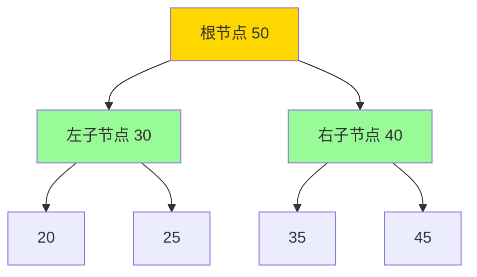

# 49. 数据结构基础

> 涵盖线性结构、树、堆、哈希表、图的基础概念与 STL 对应关系，是面试必考核心。

> 难度分布：🟢 入门 5 题 · 🟡 进阶 13 题 · 🔴 高难 2 题

[[toc]]

---

### Q1: ⭐🟢 数组和链表的核心区别是什么？各自适用场景？

A: 结论：数组连续内存、随机访问 O(1)，插入删除 O(n)；链表非连续内存、随机访问 O(n)，插入删除 O(1)（已知位置时）。

| 操作 | 数组 | 链表 |
|------|------|------|
| 随机访问 | O(1) | O(n) |
| 头部插入 | O(n) | O(1) |
| 尾部插入 | O(1)* | O(1) |
| 任意位置插入/删除 | O(n) | O(1)（已知指针） |
| 空间 | 连续，可能浪费 | 分散，额外指针开销 |

适用场景：
- 数组：频繁随机访问，数据量固定（`std::vector`, `std::array`）
- 链表：频繁头尾插入删除，大量中间插入（`std::list`, `std::forward_list`）

> 💡 **面试追问**：vector 扩容时迭代器为何失效？如何用 `reserve` 优化？`std::deque` 和 `vector` 底层有何不同？


### Q2: ⭐🟡 `std::vector` 的扩容机制是什么？

A: 结论：`vector` 以**倍增策略**扩容（通常 ×2），摊销插入复杂度为 O(1)。

扩容过程：
1. 当 `size() == capacity()` 时触发扩容
2. 分配新的 `capacity * 2` 空间（各编译器略有不同，MSVC 用 1.5×）
3. 将所有元素 **移动/复制** 到新空间
4. 释放旧空间

```cpp
std::vector<int> v;
v.reserve(100);  // 预分配，避免多次扩容
v.push_back(1);  // O(1) 摊销

// 查看容量
std::cout << v.size() << " / " << v.capacity();

// 缩容
v.shrink_to_fit();  // 请求释放多余容量（非强制）
std::vector<int>(v).swap(v);  // 强制缩容 idiom
```

关键点：扩容会使**所有迭代器、指针、引用失效**。

> 💡 **面试追问**：vector 扩容时迭代器为何失效？如何用 `reserve` 优化？`std::deque` 和 `vector` 底层有何不同？


### Q3: ⭐🟡 `std::list` vs `std::vector`，什么时候用 list？

A: 大多数情况下用 `vector`，因为缓存局部性更好，实际性能通常优于 `list`。

用 `list` 的场景：
- 需要在容器中间**频繁插入/删除**，且持有迭代器不失效
- 实现 LRU Cache（配合 `unordered_map`）
- 需要 O(1) 的 `splice`（链表节点转移）

```cpp
std::list<int> lst = {1, 2, 3, 4};
auto it = std::find(lst.begin(), lst.end(), 2);
lst.insert(it, 10);  // 在2前插入10，迭代器不失效
lst.erase(it);       // 删除2
```

---

## 二、栈与队列

> 💡 **面试追问**：vector 扩容时迭代器为何失效？如何用 `reserve` 优化？`std::deque` 和 `vector` 底层有何不同？


### Q4: ⭐🟢 栈和队列的 STL 实现及底层容器？

A:

```cpp
// 栈：LIFO，默认底层 deque，也可用 vector
std::stack<int> s;           // 底层 deque
std::stack<int, std::vector<int>> sv;  // 底层 vector（更快）

s.push(1); s.push(2);
s.top();   // 2（不弹出）
s.pop();   // 弹出2

// 队列：FIFO，底层 deque
std::queue<int> q;
q.push(1); q.push(2);
q.front(); // 1（不弹出）
q.pop();   // 弹出1

// 双端队列
std::deque<int> dq;
dq.push_front(1);
dq.push_back(2);
dq.pop_front();
```

`deque` 底层是分段连续内存（块数组），头尾插入 O(1)，随机访问 O(1)，但缓存局部性不如 `vector`。

> 💡 **面试追问**：vector 扩容时迭代器为何失效？如何用 `reserve` 优化？`std::deque` 和 `vector` 底层有何不同？


### Q5: ⭐🟡 用两个栈实现队列？

A:

```cpp
class MyQueue {
    std::stack<int> inStack, outStack;

    void transfer() {
        while (!inStack.empty()) {
            outStack.push(inStack.top());
            inStack.pop();
        }
    }
public:
    void push(int x) { inStack.push(x); }

    int pop() {
        if (outStack.empty()) transfer();
        int val = outStack.top();
        outStack.pop();
        return val;
    }

    int peek() {
        if (outStack.empty()) transfer();
        return outStack.top();
    }

    bool empty() { return inStack.empty() && outStack.empty(); }
};
```

复杂度：push O(1)，pop 摊销 O(1)。

> 💡 **面试追问**：这个知识点在实际项目中怎么用？有没有遇到过相关 bug 或性能问题？


### Q6: ⭐🟡 单调栈的原理和应用？

A: 单调栈维护一个单调递增或递减的栈，用于解决"下一个更大/更小元素"问题。

```cpp
// 下一个更大元素
vector<int> nextGreater(vector<int>& nums) {
    int n = nums.size();
    vector<int> res(n, -1);
    stack<int> st;  // 存索引

    for (int i = 0; i < n; i++) {
        while (!st.empty() && nums[i] > nums[st.top()]) {
            res[st.top()] = nums[i];
            st.pop();
        }
        st.push(i);
    }
    return res;
}
```

应用：柱状图最大矩形、接雨水、股票价格跨度。

---

## 三、树

> 💡 **面试追问**：vector 扩容时迭代器为何失效？如何用 `reserve` 优化？`std::deque` 和 `vector` 底层有何不同？


### Q7: ⭐🟢 二叉树的四种遍历方式？

A:

```cpp
struct TreeNode { int val; TreeNode *left, *right; };

// 前序：根-左-右
void preorder(TreeNode* root, vector<int>& res) {
    if (!root) return;
    res.push_back(root->val);
    preorder(root->left, res);
    preorder(root->right, res);
}

// 中序：左-根-右（BST 中序 = 升序）
void inorder(TreeNode* root, vector<int>& res) {
    if (!root) return;
    inorder(root->left, res);
    res.push_back(root->val);
    inorder(root->right, res);
}

// 后序：左-右-根
void postorder(TreeNode* root, vector<int>& res) {
    if (!root) return;
    postorder(root->left, res);
    postorder(root->right, res);
    res.push_back(root->val);
}

// 层序（BFS）
vector<vector<int>> levelOrder(TreeNode* root) {
    vector<vector<int>> res;
    if (!root) return res;
    queue<TreeNode*> q;
    q.push(root);
    while (!q.empty()) {
        int sz = q.size();
        res.push_back({});
        for (int i = 0; i < sz; i++) {
            auto node = q.front(); q.pop();
            res.back().push_back(node->val);
            if (node->left)  q.push(node->left);
            if (node->right) q.push(node->right);
        }
    }
    return res;
}
```

> 💡 **面试追问**：vector 扩容时迭代器为何失效？如何用 `reserve` 优化？`std::deque` 和 `vector` 底层有何不同？


### Q8: ⭐🟡 BST（二叉搜索树）的性质及 `std::map`/`std::set` 的底层实现？

A: BST 性质：左子树所有节点 < 根 < 右子树所有节点，中序遍历得到有序序列。

`std::map` 和 `std::set` 底层是**红黑树**：
- 查找、插入、删除均为 O(log n)
- 元素自动有序（按 key 升序）
- 迭代器稳定（增删不失效，除被删元素外）

```cpp
std::map<string, int> m;
m["apple"] = 1;
m.insert({"banana", 2});
m.find("apple");          // O(log n)
m.lower_bound("b");       // 第一个 >= "b" 的迭代器

std::set<int> s = {3, 1, 4, 1, 5};
// s = {1, 3, 4, 5}（自动去重有序）
```

> 💡 **面试追问**：红黑树和 AVL 树各自适合什么场景？STL 为何选红黑树而不是 AVL？


## 二、树结构

> 📌 **本节重点**：二叉树四种遍历、BST、AVL、红黑树、B/B+ 树，重点掌握时间复杂度与实现原理




> BST 性质：左子树所有节点 < 根 < 右子树所有节点，中序遍历得到有序序列。

### Q9: ⭐🔴 AVL 树和红黑树的区别？为什么 STL 选择红黑树？

A:

| 特性 | AVL 树 | 红黑树 |
|------|--------|--------|
| 平衡条件 | 严格：左右高度差 ≤ 1 | 宽松：最长路径 ≤ 最短路径 × 2 |
| 查找性能 | 稍快（树更矮） | 稍慢 |
| 插入/删除旋转 | 多（最多 O(log n) 次） | 少（最多 3 次） |
| 适用场景 | 查找密集 | 增删查平衡 |

红黑树五条性质：
1. 每个节点红色或黑色
2. 根节点黑色
3. 叶子节点（NIL）黑色
4. 红色节点的子节点必须是黑色（不能连续红）
5. 任意节点到叶子的所有路径，黑色节点数相同（黑高相等）

STL 选红黑树原因：工程中增删操作多，红黑树旋转次数少，综合性能更好。

> 💡 **面试追问**：红黑树和 AVL 树各自适合什么场景？STL 为何选红黑树而不是 AVL？


### Q10: ⭐🟡 如何判断二叉树是否平衡？

A:

```cpp
// O(n) 解法：后序遍历，返回高度，-1 表示不平衡
int checkHeight(TreeNode* root) {
    if (!root) return 0;
    int left = checkHeight(root->left);
    if (left == -1) return -1;
    int right = checkHeight(root->right);
    if (right == -1) return -1;
    if (abs(left - right) > 1) return -1;
    return max(left, right) + 1;
}

bool isBalanced(TreeNode* root) {
    return checkHeight(root) != -1;
}
```

---

## 四、堆

> 💡 **面试追问**：这个知识点在实际项目中怎么用？有没有遇到过相关 bug 或性能问题？


### Q11: ⭐🟡 堆的性质和 `std::priority_queue` 的使用？

A: 堆是**完全二叉树**，分为大根堆（父 ≥ 子）和小根堆（父 ≤ 子）。

用数组表示：节点 i 的左子节点 `2i+1`，右子节点 `2i+2`，父节点 `(i-1)/2`。

```cpp
// priority_queue 默认大根堆
std::priority_queue<int> maxHeap;
maxHeap.push(3); maxHeap.push(1); maxHeap.push(4);
maxHeap.top();   // 4

// 小根堆
std::priority_queue<int, vector<int>, greater<int>> minHeap;
minHeap.push(3); minHeap.push(1);
minHeap.top();   // 1

// 自定义比较
auto cmp = [](pair<int,int>& a, pair<int,int>& b) {
    return a.second > b.second;  // 按 second 升序（小根堆）
};
priority_queue<pair<int,int>, vector<pair<int,int>>, decltype(cmp)> pq(cmp);
```

操作复杂度：push/pop O(log n)，top O(1)，建堆 O(n)。

> 💡 **面试追问**：vector 扩容时迭代器为何失效？如何用 `reserve` 优化？`std::deque` 和 `vector` 底层有何不同？


### Q12: ⭐🟡 用堆求第 K 大元素？

A:

```cpp
// 方法1：小根堆，维护大小为 K 的堆
int findKthLargest(vector<int>& nums, int k) {
    priority_queue<int, vector<int>, greater<int>> minHeap;
    for (int x : nums) {
        minHeap.push(x);
        if ((int)minHeap.size() > k) minHeap.pop();
    }
    return minHeap.top();
}
// 时间 O(n log k)，空间 O(k)

// 方法2：std::nth_element，O(n) 平均
int findKthLargest2(vector<int>& nums, int k) {
    nth_element(nums.begin(), nums.begin() + k - 1, nums.end(), greater<int>());
    return nums[k - 1];
}
```

---

## 五、哈希表

> 💡 **面试追问**：vector 扩容时迭代器为何失效？如何用 `reserve` 优化？`std::deque` 和 `vector` 底层有何不同？


### Q13: ⭐🟢 哈希表的原理及 `unordered_map` vs `map`？

A: 哈希表通过**哈希函数**将 key 映射到数组下标，理想情况下查找/插入/删除均 O(1)。

冲突解决：
- **链地址法**（`unordered_map` 使用）：每个桶是链表
- **开放寻址法**：冲突时探测下一个空位

```cpp
std::unordered_map<string, int> umap;
umap["key"] = 1;
umap.find("key");   // O(1) 平均，O(n) 最坏
umap.count("key");  // 0 或 1

// 自定义哈希
struct PairHash {
    size_t operator()(const pair<int,int>& p) const {
        return hash<int>()(p.first) ^ (hash<int>()(p.second) << 32);
    }
};
unordered_map<pair<int,int>, int, PairHash> m;
```

| 对比 | `unordered_map` | `map` |
|------|-----------------|-------|
| 底层 | 哈希表 | 红黑树 |
| 查找 | O(1) 均摊 | O(log n) |
| 有序 | 否 | 是 |
| 迭代器 | 扩容后失效 | 稳定 |
| 最坏 | O(n)（哈希冲突） | O(log n) |

> 💡 **面试追问**：链表反转怎么实现？如何检测环？为什么实际性能不如 vector？


### Q14: ⭐🟡 哈希冲突如何解决？负载因子是什么？

A: `unordered_map` 默认负载因子上限为 1.0（元素数/桶数）。超过后触发 **rehash**（桶数翻倍，重新哈希所有元素），使迭代器全部失效。

```cpp
umap.reserve(1000);      // 预分配桶，减少 rehash
umap.max_load_factor(0.5); // 设置最大负载因子
umap.load_factor();       // 当前负载因子
umap.bucket_count();      // 当前桶数
```

链地址法中，若哈希函数极差导致所有元素落入同一桶，退化为 O(n)。工程中可用随机化哈希防止攻击。

> 💡 **面试追问**：哈希表扩容时为什么要 rehash？哈希冲突严重时会退化到什么复杂度？


### Q15: ⭐🟡 LRU Cache 实现？

A: 用 `unordered_map` + `list` 实现 O(1) 的 get/put。

```cpp
class LRUCache {
    int capacity;
    list<pair<int,int>> lst;  // {key, value}
    unordered_map<int, list<pair<int,int>>::iterator> mp;

public:
    LRUCache(int cap) : capacity(cap) {}

    int get(int key) {
        if (!mp.count(key)) return -1;
        lst.splice(lst.begin(), lst, mp[key]);  // 移到头部
        return mp[key]->second;
    }

    void put(int key, int value) {
        if (mp.count(key)) {
            mp[key]->second = value;
            lst.splice(lst.begin(), lst, mp[key]);
        } else {
            if ((int)lst.size() == capacity) {
                mp.erase(lst.back().first);
                lst.pop_back();
            }
            lst.push_front({key, value});
            mp[key] = lst.begin();
        }
    }
};
```

---

## 六、图

> 💡 **面试追问**：这个知识点在实际项目中怎么用？有没有遇到过相关 bug 或性能问题？


### Q16: ⭐🟢 图的两种存储方式及适用场景？

A:

```cpp
int n = 5;  // 节点数

// 邻接矩阵：O(V²) 空间，适合稠密图，O(1) 判断边是否存在
vector<vector<int>> adjMatrix(n, vector<int>(n, 0));
adjMatrix[0][1] = 1;  // 0->1 有边

// 邻接表：O(V+E) 空间，适合稀疏图
vector<vector<int>> adjList(n);
adjList[0].push_back(1);  // 0->1 有边

// 带权图用 pair
vector<vector<pair<int,int>>> adjW(n);
adjW[0].push_back({1, 5});  // 0->1，权重5
```

| 对比 | 邻接矩阵 | 邻接表 |
|------|----------|--------|
| 空间 | O(V²) | O(V+E) |
| 判断边存在 | O(1) | O(degree) |
| 遍历邻居 | O(V) | O(degree) |
| 适用 | 稠密图 | 稀疏图 |

> 💡 **面试追问**：vector 扩容时迭代器为何失效？如何用 `reserve` 优化？`std::deque` 和 `vector` 底层有何不同？


### Q17: ⭐🟡 如何检测有向图中的环？

A: 用 DFS + 颜色标记（0=未访问，1=访问中，2=已完成）。

```cpp
bool hasCycle(int node, vector<vector<int>>& adj, vector<int>& color) {
    color[node] = 1;  // 访问中
    for (int next : adj[node]) {
        if (color[next] == 1) return true;   // 回边，有环
        if (color[next] == 0 && hasCycle(next, adj, color)) return true;
    }
    color[node] = 2;  // 完成
    return false;
}

bool hasDirectedCycle(int n, vector<vector<int>>& adj) {
    vector<int> color(n, 0);
    for (int i = 0; i < n; i++)
        if (color[i] == 0 && hasCycle(i, adj, color)) return true;
    return false;
}
```

> 💡 **面试追问**：vector 扩容时迭代器为何失效？如何用 `reserve` 优化？`std::deque` 和 `vector` 底层有何不同？


## 三、堆

> 📌 **本节重点**：堆的性质、priority_queue 用法、Top-K 问题，堆排序是考察重点

### Q18: ⭐🟡 并查集（Union-Find）的实现及应用？

A: 并查集高效处理**连通性**问题，路径压缩 + 按秩合并后，近乎 O(1) 摊销。

```cpp
class UnionFind {
    vector<int> parent, rank;
public:
    UnionFind(int n) : parent(n), rank(n, 0) {
        iota(parent.begin(), parent.end(), 0);
    }

    int find(int x) {
        if (parent[x] != x) parent[x] = find(parent[x]);  // 路径压缩
        return parent[x];
    }

    bool unite(int x, int y) {
        int px = find(x), py = find(y);
        if (px == py) return false;
        if (rank[px] < rank[py]) swap(px, py);
        parent[py] = px;
        if (rank[px] == rank[py]) rank[px]++;
        return true;
    }

    bool connected(int x, int y) { return find(x) == find(y); }
};
```

应用：判断图连通性、Kruskal 最小生成树、朋友圈、岛屿数量。

---

## 七、综合面试题

> 💡 **面试追问**：vector 扩容时迭代器为何失效？如何用 `reserve` 优化？`std::deque` 和 `vector` 底层有何不同？


### Q19: ⭐🟡 `std::set`、`std::unordered_set`、`std::multiset` 的区别？

A:

| 容器 | 底层 | 有序 | 重复 | 查找 |
|------|------|------|------|------|
| `set` | 红黑树 | ✅ | ❌ | O(log n) |
| `multiset` | 红黑树 | ✅ | ✅ | O(log n) |
| `unordered_set` | 哈希表 | ❌ | ❌ | O(1) 均摊 |
| `unordered_multiset` | 哈希表 | ❌ | ✅ | O(1) 均摊 |

```cpp
set<int> s = {1, 2, 2, 3};         // {1, 2, 3}
multiset<int> ms = {1, 2, 2, 3};   // {1, 2, 2, 3}
ms.count(2);                         // 2
ms.erase(ms.find(2));               // 只删一个
```

> 💡 **面试追问**：红黑树和 AVL 树各自适合什么场景？STL 为何选红黑树而不是 AVL？


### Q20: ⭐🔴 红黑树插入后如何维持平衡？

A: 插入新节点后，初始涂为**红色**。通过以下情况处理：

**情况1**：新节点是根 → 涂黑，完成。

**情况2**：父节点是黑色 → 不违反任何规则，完成。

**情况3**：父节点是红色（叔节点也是红色）→ 父和叔涂黑，祖父涂红，递归向上处理祖父。

**情况4**：父节点是红色，叔节点是黑色：
- 4a（内侧）：先旋转变为外侧情况，再用 4b 处理
- 4b（外侧）：旋转一次，父节点变为新的子树根并涂黑，祖父涂红

最多旋转 2 次即可完成插入平衡，O(log n) 时间。

> 💡 **面试追问**：红黑树和 AVL 树各自适合什么场景？STL 为何选红黑树而不是 AVL？

---

## 📊 本章统计

| 指标 | 数量 |
|------|------|
| 总题目数 | 20 |
| 🟢 入门 | 5 |
| 🟡 进阶 | 13 |
| 🔴 高难 | 2 |
