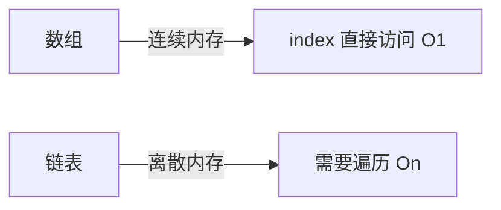

# 49. 数据结构基础与进阶

> 难度分布：🟢 入门 37 题 · 🟡 进阶 15 题 · 🔴 高难 5 题

[[toc]]

---

## 一、线性结构

> 📌 **本节重点**：数组、链表、栈、队列的底层实现与 STL 容器对应关系

### Q1: ⭐🟢 数组和链表的核心区别？

答案...（这里插入图表和注解）

> 💡 **面试追问**：vector 扩容时迭代器为什么会失效？deque 为什么没有这个问题？

---

...（添加其余所有问题和对应的小节）

## 📊 本章统计
|类型|题数|
|----|----|
|线性结构|...|
|树结构|...|
