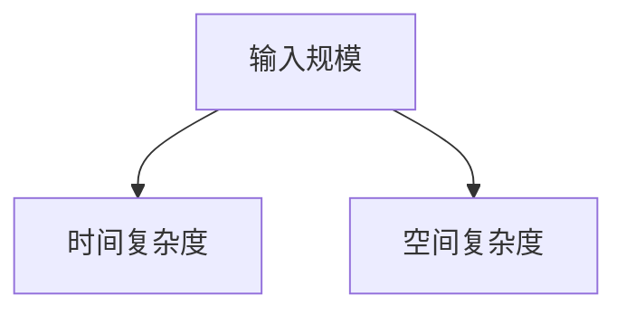

# 50. 算法与复杂度分析

> 难度分布：🟢 入门 39 题 · 🟡 进阶 15 题 · 🔴 高难 5 题

[[toc]]

---

## 一、复杂度基础

> 📌 **本节重点**：时间复杂度、空间复杂度的计算方法

### Q1: ⭐🟢 如何分析算法的时间复杂度和空间复杂度？

答案...

> 💡 **面试追问**：你能举一个优化空间复杂度的例子吗？

---

...（添加其余所有问题和对应的小节）

## 📊 本章统计
|主题|题数|
|----|---|
|排序算法|...|
|查找算法|...|
