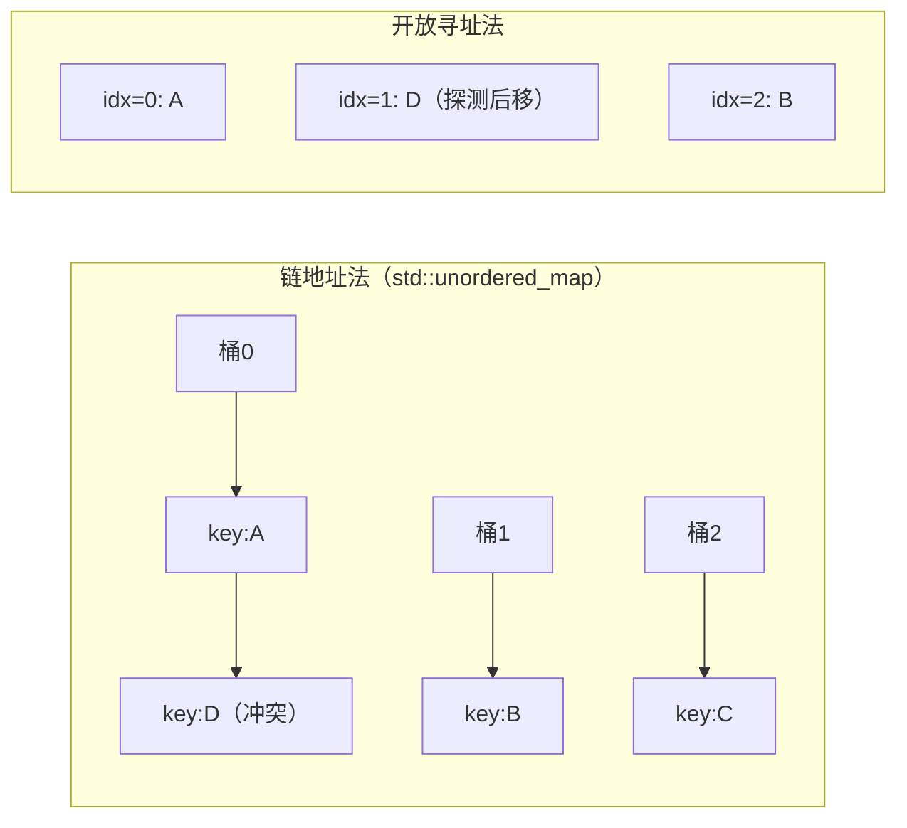
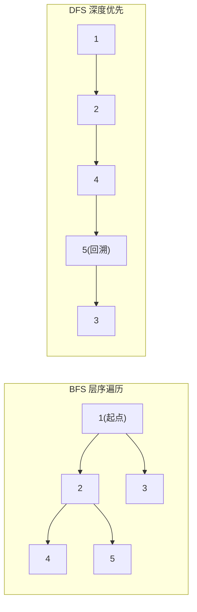

# 50. 数据结构进阶

> 涵盖跳表、B+树、Trie、线段树、并查集、一致性哈希、布隆过滤器、LFU Cache 等进阶数据结构，适合中高级岗位面试。

> 难度分布：🟢 入门 1 题 · 🟡 进阶 11 题 · 🔴 高难 5 题

[[toc]]

---

## 四、哈希表

> 📌 **本节重点**：哈希冲突处理、unordered_map vs map、负载因子，工程中使用频率极高




### Q1: ⭐🟡 跳表（Skip List）是什么？和红黑树相比如何？

A: 跳表是带有多层索引的有序链表，每层索引随机化，实现 O(log n) 的查找/插入/删除。

```
Level 3: 1 ---------> 9
Level 2: 1 --> 4 ----> 9
Level 1: 1 -> 3 -> 4 -> 7 -> 9
Level 0: 1 -> 2 -> 3 -> 4 -> 5 -> 6 -> 7 -> 8 -> 9
```

| 对比 | 跳表 | 红黑树 |
|------|------|--------|
| 实现复杂度 | 简单 | 复杂 |
| 范围查询 | 友好（链表连续） | 需要中序遍历 |
| 随机性 | 需要随机数生成 | 确定性 |
| 缓存局部性 | 差 | 稍好 |

Redis 的有序集合（ZSet）使用跳表 + 哈希表实现。

> 💡 **面试追问**：链表反转怎么实现？如何检测环？为什么实际性能不如 vector？


### Q2: ⭐🟢 `std::array` 和 C 数组的区别？

A:

```cpp
// C 数组：无大小信息，可能退化为指针
int arr[5] = {1, 2, 3, 4, 5};
void foo(int* p, int n);  // 大小信息丢失

// std::array：固定大小，携带大小信息，零开销抽象
std::array<int, 5> arr2 = {1, 2, 3, 4, 5};
arr2.size();     // 5
arr2.at(6);      // 抛出 out_of_range
arr2.data();     // 原始指针，兼容 C API
std::sort(arr2.begin(), arr2.end());  // 支持 STL 算法
```

优先使用 `std::array` 代替 C 数组；大小不固定时用 `std::vector`。

> 💡 **面试追问**：vector 扩容时迭代器为何失效？如何用 `reserve` 优化？`std::deque` 和 `vector` 底层有何不同？


### Q3: ⭐🟡 二叉树的最近公共祖先（LCA）如何求？

A:

```cpp
// 递归解法：O(n) 时间和空间
TreeNode* lowestCommonAncestor(TreeNode* root, TreeNode* p, TreeNode* q) {
    if (!root || root == p || root == q) return root;
    TreeNode* left  = lowestCommonAncestor(root->left, p, q);
    TreeNode* right = lowestCommonAncestor(root->right, p, q);
    if (left && right) return root;   // p、q 分别在两侧
    return left ? left : right;        // 都在同侧
}
```

对于 BST，可利用有序性优化：

```cpp
TreeNode* lcaBST(TreeNode* root, TreeNode* p, TreeNode* q) {
    while (root) {
        if (p->val < root->val && q->val < root->val)
            root = root->left;
        else if (p->val > root->val && q->val > root->val)
            root = root->right;
        else return root;
    }
    return nullptr;
}
```

> 💡 **面试追问**：这个知识点在实际项目中怎么用？有没有遇到过相关 bug 或性能问题？


### Q4: ⭐🔴 `std::unordered_map` 在最坏情况下为什么是 O(n)？如何避免？

A: 当所有 key 的哈希值相同时，所有元素落入同一个桶，退化为链表查找，变为 O(n)。

实际攻击场景：竞赛中攻击者构造特殊输入，使默认哈希函数大量冲突。

防御方案：

```cpp
// 方案1：使用随机化哈希（C++14+）
struct SafeHash {
    static uint64_t splitmix64(uint64_t x) {
        x += 0x9e3779b97f4a7c15;
        x = (x ^ (x >> 30)) * 0xbf58476d1ce4e5b9;
        x = (x ^ (x >> 27)) * 0x94d049bb133111eb;
        return x ^ (x >> 31);
    }
    size_t operator()(uint64_t x) const {
        static const uint64_t FIXED_RANDOM =
            chrono::steady_clock::now().time_since_epoch().count();
        return splitmix64(x + FIXED_RANDOM);
    }
};
unordered_map<int, int, SafeHash> safeMap;

// 方案2：reserve 避免频繁 rehash
safeMap.reserve(1024);
safeMap.max_load_factor(0.25);  // 降低负载因子
```

---

> 💡 **面试追问**：链表反转怎么实现？如何检测环？为什么实际性能不如 vector？


### Q5: ⭐🟡 `std::deque` 的底层实现是什么？为什么比 `vector` 更适合两端操作？

A: `std::deque`（双端队列）采用**分段连续内存**（segmented storage）实现，而非单块连续数组。

**核心结构：**
- 维护一个**中控数组**（map），存储多个固定大小的**缓冲区块**指针
- 每个缓冲区块大小固定（通常 512 字节或 `sizeof(T)` 的倍数）
- 迭代器持有 `cur`、`first`、`last`（当前块的范围）和 `node`（指向 map 中哪个块）

```
map:  [nullptr] [ptr0] [ptr1] [ptr2] [nullptr]
                   |      |      |
               [A B C] [D E F] [G H I]
                                        ^-- 可向右扩展新块
         ^-- 也可向左扩展新块
```

**操作复杂度对比：**

| 操作 | deque | vector |
|------|-------|--------|
| `push_back` | O(1) 均摊 | O(1) 均摊 |
| `push_front` | **O(1) 均摊** | O(n) |
| 随机访问 | O(1)（需多次指针跳转） | O(1)（直接计算） |
| 中间插入 | O(n) | O(n) |
| 内存局部性 | 差（跨块跳跃） | 好（连续） |

**为什么 `stack`/`queue` 的默认底层是 `deque`？**  
因为 `deque` 两端 O(1) 操作，且不像 `vector` 需要预留大量空间。

> 💡 面试追问：deque 的迭代器为什么比 vector 慢？  
> 因为迭代器在 `operator++` 时需要检查是否到达当前块末尾，并可能跳转到下一个块，多了分支判断。

---


## 五、图

> 📌 **本节重点**：图的存储方式、BFS/DFS、最短路径、最小生成树，系统设计中常用




### Q6: ⭐🟡 如何实现循环队列？为什么要空出一个位置区分满和空？

A: 循环队列（Ring Buffer）使用固定大小数组 + 头尾指针实现，核心难点是**区分队满和队空**。

**两种方案：**
1. **空一位法**：数组大小为 `capacity+1`，`(tail+1) % size == head` 表示满
2. **计数法**：维护一个 `size` 计数器

```cpp
class CircularQueue {
    vector<int> data;
    int head, tail, capacity;
public:
    CircularQueue(int k) : data(k+1), head(0), tail(0), capacity(k+1) {}

    bool enqueue(int val) {
        if (isFull()) return false;
        data[tail] = val;
        tail = (tail + 1) % capacity;
        return true;
    }

    bool dequeue() {
        if (isEmpty()) return false;
        head = (head + 1) % capacity;
        return true;
    }

    int front() { return isEmpty() ? -1 : data[head]; }
    int rear()  { return isEmpty() ? -1 : data[(tail - 1 + capacity) % capacity]; }

    bool isEmpty() { return head == tail; }
    bool isFull()  { return (tail + 1) % capacity == head; }
};
```

**时间复杂度**：所有操作 O(1)  
**空间复杂度**：O(k)

> 💡 面试追问：为什么不用 `head == tail` 同时表示满和空？  
> 两种情况无法区分，必须引入额外信息（空一位 or 计数器）。

---

### Q7: ⭐🟡 链表反转的迭代和递归两种实现，区别是什么？

A: 链表反转是高频基础题，两种实现各有特点：

```cpp
struct ListNode {
    int val;
    ListNode* next;
    ListNode(int x) : val(x), next(nullptr) {}
};

// ===== 迭代法 =====
// 时间 O(n)，空间 O(1)
ListNode* reverseIterative(ListNode* head) {
    ListNode* prev = nullptr;
    ListNode* curr = head;
    while (curr) {
        ListNode* next = curr->next;  // 保存下一个
        curr->next = prev;            // 反转指针
        prev = curr;                  // prev 前进
        curr = next;                  // curr 前进
    }
    return prev;  // prev 是新头
}

// ===== 递归法 =====
// 时间 O(n)，空间 O(n)（调用栈）
ListNode* reverseRecursive(ListNode* head) {
    if (!head || !head->next) return head;

    ListNode* newHead = reverseRecursive(head->next);
    head->next->next = head;  // 后继节点指回自己
    head->next = nullptr;     // 断开原来的链接
    return newHead;
}

// ===== 反转链表的一部分（进阶）=====
// 反转 [left, right] 区间
ListNode* reverseBetween(ListNode* head, int left, int right) {
    ListNode dummy(0);
    dummy.next = head;
    ListNode* pre = &dummy;
    for (int i = 1; i < left; i++) pre = pre->next;

    ListNode* curr = pre->next;
    for (int i = 0; i < right - left; i++) {
        ListNode* next = curr->next;
        curr->next = next->next;
        next->next = pre->next;
        pre->next = next;
    }
    return dummy.next;
}
```

**对比：**

| 方式 | 时间 | 空间 | 特点 |
|------|------|------|------|
| 迭代 | O(n) | O(1) | 推荐，空间最优 |
| 递归 | O(n) | O(n) | 代码简洁，有栈溢出风险 |

> 💡 面试追问：K 个一组反转链表（LeetCode 25）如何实现？  
> 每 K 个节点调用一次反转，并处理不足 K 个时的边界。

---

### Q8: ⭐🟡 B 树和 B+ 树有什么区别？数据库索引为什么选 B+ 树？

A: **B 树（B-Tree）**和 **B+ 树**都是多路平衡搜索树，区别如下：

| 特征 | B 树 | B+ 树 |
|------|------|-------|
| 数据存储位置 | 内部节点和叶节点均存数据 | **只有叶节点存完整数据** |
| 内部节点 | 存 key + data | 只存 key（路由用） |
| 叶节点链接 | 无 | **叶节点通过链表相连** |
| 查询路径 | 可在中间节点命中 | **必须到叶节点** |
| 范围查询 | 需要回溯中序遍历 | **直接遍历叶节点链表，极快** |
| 磁盘 I/O | 内部节点存 data，扇出较小 | **内部节点只存 key，扇出更大** |

**数据库（MySQL InnoDB）选 B+ 树的原因：**

1. **更高的扇出**：内部节点只存 key，一个磁盘页（16KB）能存更多 key，树更矮，I/O 次数更少
2. **叶节点链表支持高效范围查询**：`WHERE id BETWEEN 100 AND 200` 直接遍历叶节点链表
3. **查询性能稳定**：所有查询路径等长（必到叶节点），无"运气好"的中间命中
4. **顺序访问友好**：叶节点链表天然支持全表扫描

```
B+ 树示意（3阶）：
           [30 | 60]              ← 内部节点，只存 key
          /    |        [10|20] [40|50] [70|80]      ← 叶节点，存 key+data
       ↓→→→→↓→→→→↓→→→→↓         ← 叶节点链表
```

> 💡 面试追问：为什么 MongoDB 用 B 树而不是 B+ 树？  
> MongoDB 是文档数据库，记录本身很大，文档查询更多是点查而非范围查，B 树中间节点命中更有优势。

---

### Q9: ⭐🔴 线段树（Segment Tree）是什么？如何实现区间查询和区间更新？

A: 线段树是一种二叉树，每个节点维护一段区间的聚合信息（和/最大值等），支持：
- **区间查询**：O(log n)
- **单点/区间更新**：O(log n)（区间更新需要懒标记 Lazy Tag）

```cpp
class SegmentTree {
    int n;
    vector<long long> tree, lazy;

    void build(vector<int>& arr, int node, int start, int end) {
        if (start == end) {
            tree[node] = arr[start];
            return;
        }
        int mid = (start + end) / 2;
        build(arr, 2*node, start, mid);
        build(arr, 2*node+1, mid+1, end);
        tree[node] = tree[2*node] + tree[2*node+1];
    }

    void pushDown(int node, int len) {
        if (lazy[node]) {
            int mid = len / 2;
            tree[2*node]   += lazy[node] * mid;
            tree[2*node+1] += lazy[node] * (len - mid);
            lazy[2*node]   += lazy[node];
            lazy[2*node+1] += lazy[node];
            lazy[node] = 0;
        }
    }

    void update(int node, int start, int end, int l, int r, int val) {
        if (r < start || end < l) return;
        if (l <= start && end <= r) {
            tree[node] += (long long)val * (end - start + 1);
            lazy[node] += val;
            return;
        }
        pushDown(node, end - start + 1);
        int mid = (start + end) / 2;
        update(2*node, start, mid, l, r, val);
        update(2*node+1, mid+1, end, l, r, val);
        tree[node] = tree[2*node] + tree[2*node+1];
    }

    long long query(int node, int start, int end, int l, int r) {
        if (r < start || end < l) return 0;
        if (l <= start && end <= r) return tree[node];
        pushDown(node, end - start + 1);
        int mid = (start + end) / 2;
        return query(2*node, start, mid, l, r)
             + query(2*node+1, mid+1, end, l, r);
    }

public:
    SegmentTree(vector<int>& arr) : n(arr.size()), tree(4*arr.size()), lazy(4*arr.size(), 0) {
        build(arr, 1, 0, n-1);
    }
    void update(int l, int r, int val) { update(1, 0, n-1, l, r, val); }
    long long query(int l, int r) { return query(1, 0, n-1, l, r); }
};
```

**复杂度**：
- 建树：O(n)
- 查询/更新：O(log n)
- 空间：O(4n)

> 💡 面试追问：什么时候用线段树 vs 树状数组（BIT）？  
> BIT 实现简单，只支持前缀和；线段树更通用，支持区间最大/最小值等复杂查询。

---

### Q10: ⭐🟡 Trie 树（前缀树）的原理是什么？适合哪些场景？

A: Trie（发音 "try"）是一种**多叉树**，利用字符串的公共前缀减少存储空间，专为字符串检索设计。

```cpp
class Trie {
    struct TrieNode {
        TrieNode* children[26];
        bool isEnd;
        int count;  // 经过该节点的单词数（用于统计）
        TrieNode() : isEnd(false), count(0) {
            fill(children, children+26, nullptr);
        }
    };

    TrieNode* root;

public:
    Trie() : root(new TrieNode()) {}

    void insert(const string& word) {
        TrieNode* node = root;
        for (char c : word) {
            int idx = c - 'a';
            if (!node->children[idx])
                node->children[idx] = new TrieNode();
            node = node->children[idx];
            node->count++;
        }
        node->isEnd = true;
    }

    bool search(const string& word) {
        TrieNode* node = root;
        for (char c : word) {
            int idx = c - 'a';
            if (!node->children[idx]) return false;
            node = node->children[idx];
        }
        return node->isEnd;
    }

    bool startsWith(const string& prefix) {
        TrieNode* node = root;
        for (char c : prefix) {
            int idx = c - 'a';
            if (!node->children[idx]) return false;
            node = node->children[idx];
        }
        return true;
    }

    // 统计以 prefix 开头的单词数
    int countPrefix(const string& prefix) {
        TrieNode* node = root;
        for (char c : prefix) {
            int idx = c - 'a';
            if (!node->children[idx]) return 0;
            node = node->children[idx];
        }
        return node->count;
    }
};
```

**典型应用场景：**
1. **搜索引擎自动补全**（输入前缀，提示候选词）
2. **拼写检查**
3. **IP 路由表查找**（最长前缀匹配）
4. **敏感词过滤**（AC 自动机的基础）

**复杂度**：插入/查找 O(m)（m 为字符串长度），空间 O(总字符数 × 字符集大小）

> 💡 面试追问：Trie 的空间浪费如何解决？  
> 使用压缩 Trie（Radix Tree）或用 `unordered_map<char, TrieNode*>` 替代固定数组。

---

### Q11: ⭐🟡 如何实现二叉树的层序遍历（BFS）？

A: 层序遍历使用**队列**实现 BFS，逐层处理节点。

```cpp
struct TreeNode {
    int val;
    TreeNode *left, *right;
    TreeNode(int x) : val(x), left(nullptr), right(nullptr) {}
};

// 基础层序遍历
vector<int> levelOrder(TreeNode* root) {
    if (!root) return {};
    vector<int> result;
    queue<TreeNode*> q;
    q.push(root);

    while (!q.empty()) {
        TreeNode* node = q.front(); q.pop();
        result.push_back(node->val);
        if (node->left)  q.push(node->left);
        if (node->right) q.push(node->right);
    }
    return result;
}

// 按层分组（LeetCode 102 变体）
vector<vector<int>> levelOrderGrouped(TreeNode* root) {
    if (!root) return {};
    vector<vector<int>> result;
    queue<TreeNode*> q;
    q.push(root);

    while (!q.empty()) {
        int sz = q.size();  // 当前层的节点数
        vector<int> level;

        for (int i = 0; i < sz; i++) {
            TreeNode* node = q.front(); q.pop();
            level.push_back(node->val);
            if (node->left)  q.push(node->left);
            if (node->right) q.push(node->right);
        }
        result.push_back(level);
    }
    return result;
}

// 锯齿形层序（LeetCode 103）
vector<vector<int>> zigzagLevelOrder(TreeNode* root) {
    if (!root) return {};
    vector<vector<int>> result;
    queue<TreeNode*> q;
    q.push(root);
    bool leftToRight = true;

    while (!q.empty()) {
        int sz = q.size();
        deque<int> level;
        for (int i = 0; i < sz; i++) {
            TreeNode* node = q.front(); q.pop();
            if (leftToRight) level.push_back(node->val);
            else             level.push_front(node->val);
            if (node->left)  q.push(node->left);
            if (node->right) q.push(node->right);
        }
        result.push_back(vector<int>(level.begin(), level.end()));
        leftToRight = !leftToRight;
    }
    return result;
}
```

**时间复杂度**：O(n)，每个节点访问一次  
**空间复杂度**：O(w)，w 为树的最大宽度（最坏 O(n/2) ≈ O(n)）

> 💡 面试追问：DFS 和 BFS 各适合什么场景？  
> DFS：递归自然，适合路径问题；BFS：适合最短路、按层处理，但需要额外队列空间。

---


## 六、高频综合题

> 📌 **本节重点**：LRU/LFU Cache、Top-K、布隆过滤器等经典面试综合题

### Q12: ⭐🔴 Prim 和 Kruskal 算法的区别？分别适合什么图？

A: 两者都用于求**最小生成树（MST）**，策略不同：

**Kruskal（克鲁斯卡尔）**：
- 按边权排序，用并查集判断是否成环，贪心选边
- 适合**稀疏图**（边少）

```cpp
struct Edge { int u, v, w; };

struct UnionFind {
    vector<int> parent, rank;
    UnionFind(int n) : parent(n), rank(n, 0) {
        iota(parent.begin(), parent.end(), 0);
    }
    int find(int x) {
        return parent[x] == x ? x : parent[x] = find(parent[x]);
    }
    bool unite(int x, int y) {
        x = find(x); y = find(y);
        if (x == y) return false;
        if (rank[x] < rank[y]) swap(x, y);
        parent[y] = x;
        if (rank[x] == rank[y]) rank[x]++;
        return true;
    }
};

int kruskal(int n, vector<Edge>& edges) {
    sort(edges.begin(), edges.end(), [](auto& a, auto& b){ return a.w < b.w; });
    UnionFind uf(n);
    int total = 0, cnt = 0;
    for (auto& e : edges) {
        if (uf.unite(e.u, e.v)) {
            total += e.w;
            if (++cnt == n - 1) break;
        }
    }
    return total;
}
```

**Prim（普里姆）**：
- 从任意顶点出发，贪心扩展最小边到新顶点（类似 Dijkstra）
- 适合**稠密图**（边多）

```cpp
int prim(int n, vector<vector<pair<int,int>>>& adj) {
    vector<int> dist(n, INT_MAX);
    vector<bool> inMST(n, false);
    priority_queue<pair<int,int>, vector<pair<int,int>>, greater<>> pq;
    dist[0] = 0;
    pq.push({0, 0});
    int total = 0;

    while (!pq.empty()) {
        auto [d, u] = pq.top(); pq.pop();
        if (inMST[u]) continue;
        inMST[u] = true;
        total += d;

        for (auto [v, w] : adj[u]) {
            if (!inMST[v] && w < dist[v]) {
                dist[v] = w;
                pq.push({w, v});
            }
        }
    }
    return total;
}
```

| 算法 | 时间复杂度 | 适合 |
|------|-----------|------|
| Kruskal | O(E log E) | 稀疏图 |
| Prim（堆优化） | O(E log V) | 稠密图 |

> 💡 面试追问：MST 一定唯一吗？  
> 不一定，当存在权重相同的边时，可能有多个 MST。但如果所有边权唯一，MST 唯一。

---

### Q13: ⭐🟡 Bellman-Ford、Dijkstra、Floyd-Warshall 三种最短路算法如何选择？

A: 三种算法适用不同场景：

| 算法 | 时间 | 能否处理负权边 | 能否检测负环 | 适用 |
|------|------|--------------|------------|------|
| Dijkstra | O(E log V) | ❌ | ❌ | 单源最短路，无负权 |
| Bellman-Ford | O(VE) | ✅ | ✅ | 单源最短路，有负权 |
| Floyd-Warshall | O(V³) | ✅ | ✅（对角线为负） | 全源最短路 |

```cpp
// Dijkstra（堆优化，无负权）
vector<int> dijkstra(int src, int n, vector<vector<pair<int,int>>>& adj) {
    vector<int> dist(n, INT_MAX);
    priority_queue<pair<int,int>, vector<pair<int,int>>, greater<>> pq;
    dist[src] = 0;
    pq.push({0, src});
    while (!pq.empty()) {
        auto [d, u] = pq.top(); pq.pop();
        if (d > dist[u]) continue;
        for (auto [v, w] : adj[u]) {
            if (dist[u] + w < dist[v]) {
                dist[v] = dist[u] + w;
                pq.push({dist[v], v});
            }
        }
    }
    return dist;
}

// Bellman-Ford（支持负权，检测负环）
bool bellmanFord(int src, int n, vector<tuple<int,int,int>>& edges, vector<int>& dist) {
    dist.assign(n, INT_MAX);
    dist[src] = 0;
    for (int i = 0; i < n - 1; i++) {
        for (auto [u, v, w] : edges) {
            if (dist[u] != INT_MAX && dist[u] + w < dist[v])
                dist[v] = dist[u] + w;
        }
    }
    // 第 n 次松弛，若仍可松弛则存在负环
    for (auto [u, v, w] : edges) {
        if (dist[u] != INT_MAX && dist[u] + w < dist[v])
            return false;  // 存在负环
    }
    return true;
}
```

**为什么 Dijkstra 不能处理负权？**  
Dijkstra 的贪心假设：从优先队列取出的节点距离已最优。但负权边可能让"更远"的节点经过负权边后反而更近，破坏了这个假设。

> 💡 面试追问：在实际系统中，负权边有什么实际意义？  
> 例如收费公路的优惠补贴（走某路段反而节省费用），或货币套利场景（负对数权重）。

---

### Q14: ⭐🔴 一致性哈希（Consistent Hashing）是什么？如何解决节点增减问题？

A: 一致性哈希是分布式系统中的关键算法，解决节点增减时**数据重分布**问题。

**传统哈希的问题：**  
`node = hash(key) % N`，当 N 变化时几乎所有 key 都需要重新映射。

**一致性哈希的解法：**

1. 将哈希空间构成一个**哈希环**（[0, 2³²-1]）
2. 服务器节点映射到环上的某个位置
3. key 顺时针找到第一个节点，即为目标节点
4. 增删节点只影响**相邻区间**的数据，只有 1/N 的数据需要迁移

```cpp
#include <map>
#include <string>
#include <functional>

class ConsistentHash {
    std::map<size_t, std::string> ring;  // 哈希环
    int replicas;  // 虚拟节点数

    size_t hashFunc(const std::string& key) {
        return std::hash<std::string>{}(key);
    }

public:
    ConsistentHash(int replicas = 150) : replicas(replicas) {}

    void addNode(const std::string& node) {
        for (int i = 0; i < replicas; i++) {
            size_t h = hashFunc(node + "#" + to_string(i));
            ring[h] = node;
        }
    }

    void removeNode(const std::string& node) {
        for (int i = 0; i < replicas; i++) {
            size_t h = hashFunc(node + "#" + to_string(i));
            ring.erase(h);
        }
    }

    std::string getNode(const std::string& key) {
        if (ring.empty()) return "";
        size_t h = hashFunc(key);
        auto it = ring.lower_bound(h);
        if (it == ring.end()) it = ring.begin();  // 绕回环头
        return it->second;
    }
};
```

**虚拟节点的作用：**  
每个物理节点对应多个虚拟节点，使数据分布更均匀，避免"热点"问题。

**实际应用：** Memcached、Redis Cluster、Cassandra、Dynamo

> 💡 面试追问：虚拟节点数设多少合适？  
> 通常 100-200，更多虚拟节点分布更均匀，但内存开销更大。

---

### Q15: ⭐🟡 布隆过滤器（Bloom Filter）的原理是什么？有哪些限制？

A: 布隆过滤器是一种空间高效的**概率型数据结构**，用于判断元素是否在集合中。

**原理：**
- 维护一个 m 位的 bit 数组，初始全 0
- 插入时：用 k 个哈希函数计算 k 个位置，全部置 1
- 查询时：检查 k 个位置是否全为 1

```cpp
#include <vector>
#include <functional>

class BloomFilter {
    vector<bool> bits;
    int m, k;  // m: bit 数组大小，k: 哈希函数数量

    vector<size_t> getHashes(const string& key) {
        vector<size_t> hashes(k);
        size_t h1 = hash<string>{}(key);
        size_t h2 = hash<string>{}(key + "_salt");
        for (int i = 0; i < k; i++) {
            hashes[i] = (h1 + i * h2) % m;  // 双重哈希模拟 k 个哈希函数
        }
        return hashes;
    }

public:
    BloomFilter(int m, int k) : bits(m, false), m(m), k(k) {}

    void insert(const string& key) {
        for (size_t pos : getHashes(key))
            bits[pos] = true;
    }

    bool mayContain(const string& key) {
        for (size_t pos : getHashes(key))
            if (!bits[pos]) return false;
        return true;  // 可能存在（有误判）
    }
    // 注意：没有 remove 操作（会影响其他元素）
};
```

**关键特性：**
- **假阳性（False Positive）**：可能误报"存在"——实际不存在 → 允许
- **假阴性（False Negative）**：绝不会误报"不存在"——实际存在 → 不可能
- **无法删除元素**（Counting Bloom Filter 变体支持删除）

**实际应用：**
1. Redis 用于缓存穿透防护（判断 key 是否可能存在）
2. Chrome 浏览器安全浏览（判断 URL 是否在恶意 URL 列表中）
3. 数据库去重（避免磁盘 I/O）

**误判率公式：** `p ≈ (1 - e^(-kn/m))^k`（n 为元素数）

> 💡 面试追问：如何确定最优的 k 值？  
> `k = (m/n) * ln2`，此时误判率最低。

---

### Q16: ⭐🟡 数组中找重复数字有哪些方法？各有什么取舍？

A: 经典题目，多种解法权衡时空复杂度：

```cpp
// 场景：n+1 个数，范围 [1,n]，找一个重复数（LeetCode 287）

// 方法 1：哈希表 — O(n) 时间，O(n) 空间
int findDuplicate_hash(vector<int>& nums) {
    unordered_set<int> seen;
    for (int x : nums) {
        if (seen.count(x)) return x;
        seen.insert(x);
    }
    return -1;
}

// 方法 2：排序后比较 — O(n log n) 时间，O(1) 空间
int findDuplicate_sort(vector<int>& nums) {
    sort(nums.begin(), nums.end());
    for (int i = 1; i < nums.size(); i++)
        if (nums[i] == nums[i-1]) return nums[i];
    return -1;
}

// 方法 3：二分查找（不修改数组，O(n log n) 时间，O(1) 空间）
int findDuplicate_binary(vector<int>& nums) {
    int lo = 1, hi = nums.size() - 1;
    while (lo < hi) {
        int mid = (lo + hi) / 2;
        int cnt = count_if(nums.begin(), nums.end(), [mid](int x){ return x <= mid; });
        if (cnt > mid) hi = mid;
        else lo = mid + 1;
    }
    return lo;
}

// 方法 4：Floyd 判圈（最优！O(n) 时间，O(1) 空间，不修改数组）
// 将数组看作链表：index -> nums[index]，重复数字是环的入口
int findDuplicate_floyd(vector<int>& nums) {
    int slow = nums[0], fast = nums[0];
    do {
        slow = nums[slow];
        fast = nums[nums[fast]];
    } while (slow != fast);

    slow = nums[0];
    while (slow != fast) {
        slow = nums[slow];
        fast = nums[fast];
    }
    return slow;
}
```

| 方法 | 时间 | 空间 | 修改数组 |
|------|------|------|---------|
| 哈希表 | O(n) | O(n) | 否 |
| 排序 | O(n log n) | O(1) | **是** |
| 二分查找 | O(n log n) | O(1) | 否 |
| Floyd 判圈 | O(n) | O(1) | 否 ✅ |

> 💡 面试追问：如果允许有多个重复数字，如何找出所有重复数？  
> 使用 `nums[abs(nums[i])-1] *= -1` 的原地标记法，O(n) 时间 O(1) 空间。

---

### Q17: ⭐🔴 如何实现 LFU Cache（最不常使用缓存）？

A: LFU（Least Frequently Used）比 LRU 更复杂：需要同时维护**访问频率**和**相同频率下的 LRU 顺序**。

**数据结构设计：**
- `key -> {value, freq}` 哈希表
- `freq -> LRU链表` 哈希表（用 `list` + 迭代器）
- `minFreq` 记录当前最小频率

```cpp
class LFUCache {
    int capacity, minFreq;
    unordered_map<int, pair<int,int>> keyMap;  // key -> {val, freq}
    unordered_map<int, list<int>> freqMap;     // freq -> keys（LRU 顺序）
    unordered_map<int, list<int>::iterator> iterMap;  // key -> iterator

    void touch(int key) {
        int freq = keyMap[key].second;
        freqMap[freq].erase(iterMap[key]);
        if (freqMap[freq].empty()) {
            freqMap.erase(freq);
            if (minFreq == freq) minFreq++;
        }
        freq++;
        keyMap[key].second = freq;
        freqMap[freq].push_front(key);
        iterMap[key] = freqMap[freq].begin();
    }

public:
    LFUCache(int capacity) : capacity(capacity), minFreq(0) {}

    int get(int key) {
        if (!keyMap.count(key)) return -1;
        touch(key);
        return keyMap[key].first;
    }

    void put(int key, int value) {
        if (capacity <= 0) return;
        if (keyMap.count(key)) {
            keyMap[key].first = value;
            touch(key);
            return;
        }
        if ((int)keyMap.size() == capacity) {
            // 淘汰最小频率中最久未用的
            int evict = freqMap[minFreq].back();
            freqMap[minFreq].pop_back();
            if (freqMap[minFreq].empty()) freqMap.erase(minFreq);
            keyMap.erase(evict);
            iterMap.erase(evict);
        }
        keyMap[key] = {value, 1};
        freqMap[1].push_front(key);
        iterMap[key] = freqMap[1].begin();
        minFreq = 1;
    }
};
```

**所有操作均为 O(1)**（核心是三个哈希表 + list 的配合）

**LRU vs LFU 对比：**

| 特性 | LRU | LFU |
|------|-----|-----|
| 淘汰策略 | 最久未访问 | 访问频率最低 |
| 实现复杂度 | 简单（双向链表+哈希） | 复杂（三层数据结构） |
| 适用场景 | 时间局部性强 | 频率局部性强（热点数据稳定） |
| 缓存污染 | 偶发大批量请求会污染 | 新数据初期频率低，容易被淘汰 |

> 💡 面试追问：LFU 的冷启动问题如何解决？  
> 可以使用 Window-LFU（新数据先进 LRU 窗口，升温后进 LFU 主缓存）。

---

---

---

## 📊 本章统计

| 指标 | 数量 |
|------|------|
| 总题目数 | 17 |
| 🟢 入门 | 1 |
| 🟡 进阶 | 11 |
| 🔴 高难 | 5 |
